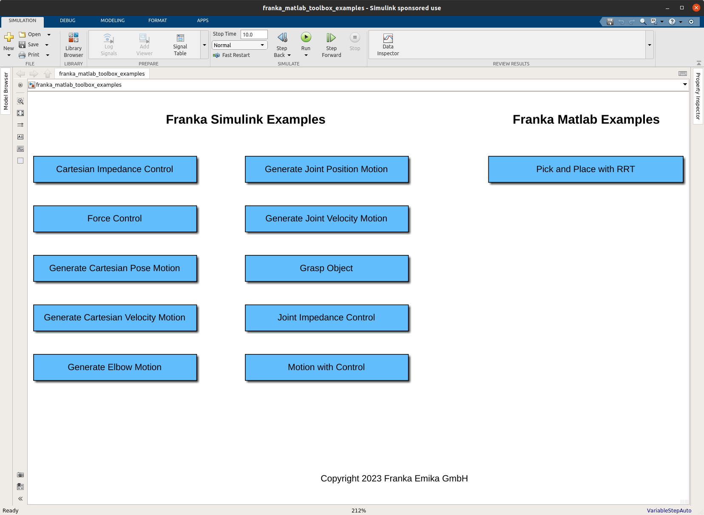
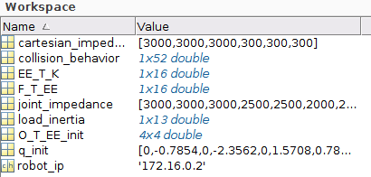
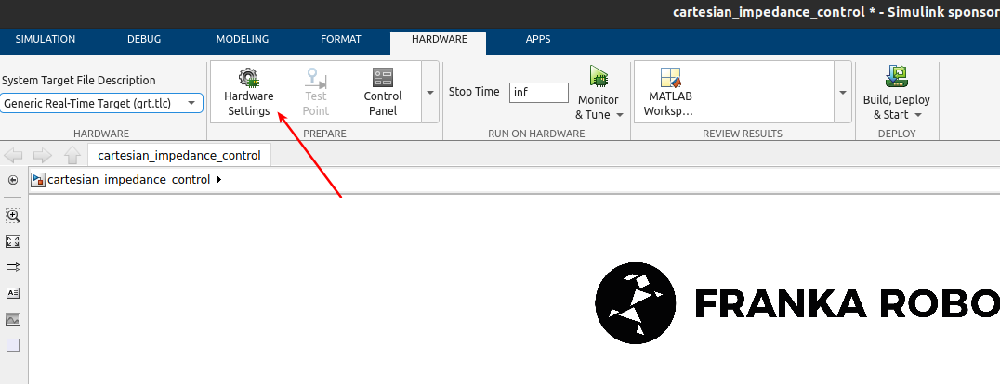
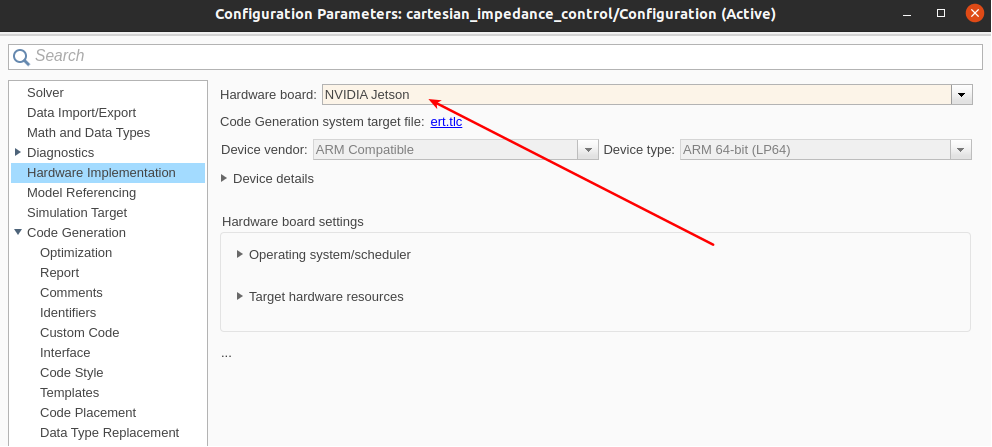
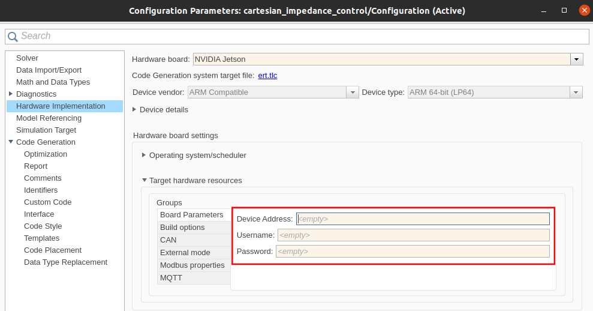
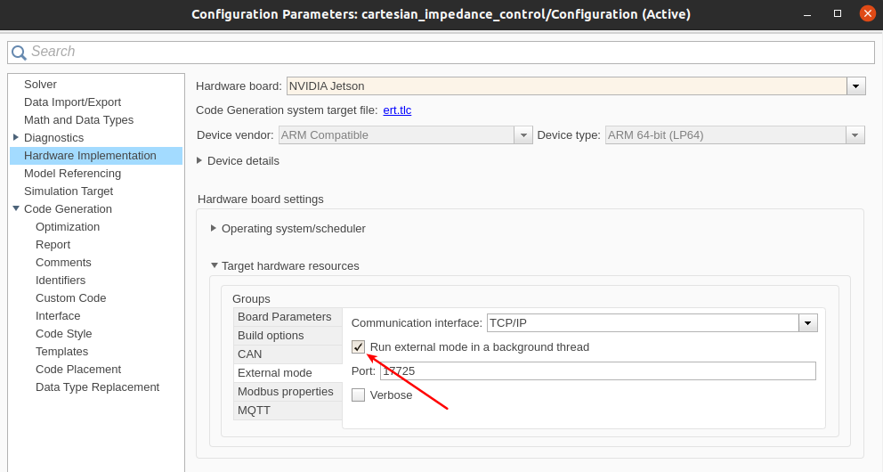
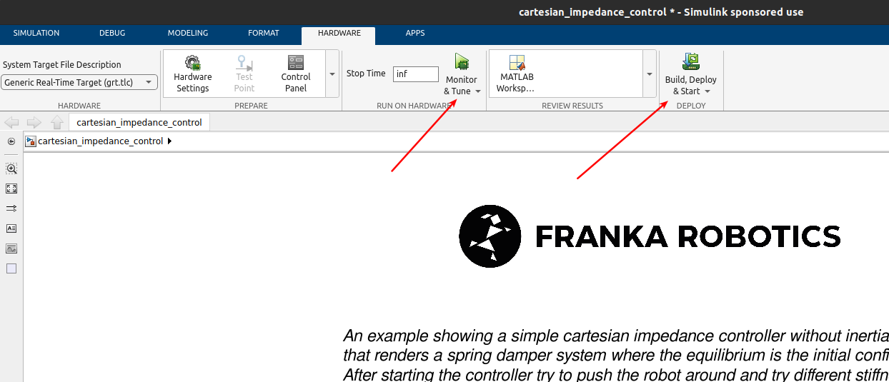
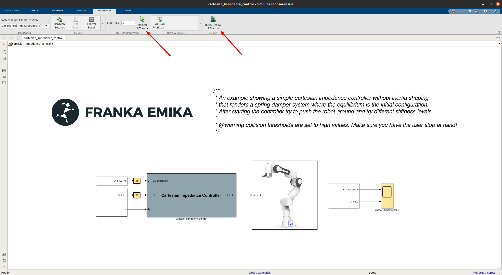
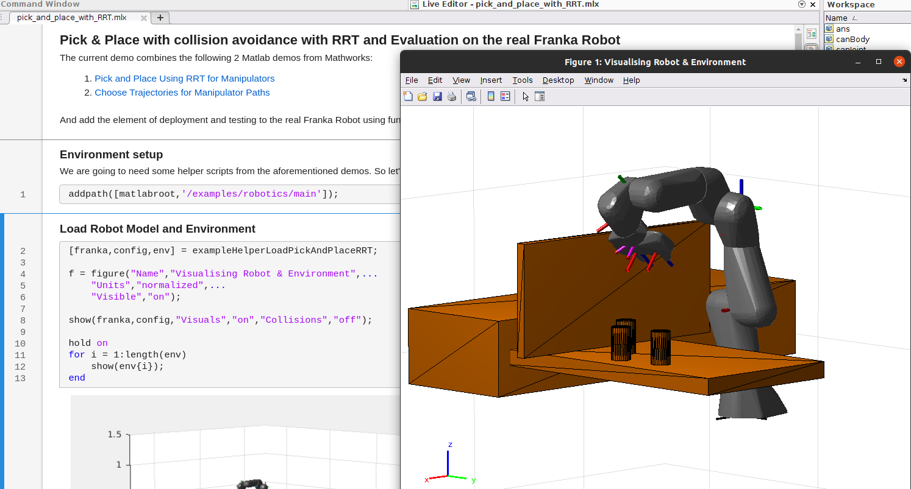

Getting started
===============

Overview
--------

A set of Simulink & MATLAB examples is included within the 
Franka MATLAB Toolbox. Feel free to experiment, adjust them 
and expand them in order to fit your project needs.

You can navigate through the examples by typing: 

.. code-block:: matlab

    >> franka_toolbox_examples();

    Franka MATLAB Toolbox Examples Navigator.

Simulink Build & Deploy - Franka AI Companion  
---------------------------------------------

After opening, double clicking on any of the Simulink models the robot settings will be loaded automatically in the 
workspace, in the form of the object `frs`.

    The Franka Robot Settings object.

The robot_ip is set to 172.16.0.2. Make sure that the robot_ip, as well as all the other parameters matches your 
setup for your intended purposes.

.. code-block:: shell

    >> frs.robot_ip = <your robot ip string>

You can modify the default settings for the FrankaRobotSettings with

.. code-block:: shell

    >> edit FrankaRobotSettings.m

Start by clicking "Run on Custom Hardware" in the Simulink APPS pane.

.. figure:: _static/run_on_custom_hardware.png
    :align: center
    :figclass: align-center

    "Run on Custom Hardware"

Continue by clicking on the "Hardware Settings"

    "Hardware Settings"

Select the "NVIDIA Jetson" Hardware board

    "Select NVIDIA Jetson Hardware Board"

Set the `Device Address`, `Username` and `Password` for your NVIDIA Jetson platform.

    "Board Parameters"

.. important::

    For setting the specific port in which the ssh server is exposed by the currently targeted docker
    instance, please excecute the following MATLAB command:

    .. code-block:: shell

        >> franka_ai_companion_switch_port(<desired port number>);

In case you operate in standard Jetson Hardware Platform with a standard ssh server configuration, 
the step above is not necessary.

It is also highly recommended to run the external mode as a background thread, so that
the real-time 1kHz won't get potentially disrupted when built with "Monitor & Tuning".

    "Run External Mode as a Background Thread"

You can now build and deploy for your NVIDIA Jetson Platform!

.. warning::

    Before choosing the "Monitor & Tune" for utilzing the External Mode, make sure that 
    the option "Nonreusable function" has been chosen in Model Settings-->Code Generation-->
    Interface.

    .. figure:: _static/model_settings_interface_non_reusable_function.png
        :align: center
        :figclass: align-center
        :scale: 50%

        "Nonreusable function option is required for building with External-Mode"

    "Build & Deploy"

Simulink Build & Deploy - Linux Host
------------------------------------

Let's start by selecting the `Run on custom hardware` App from the Apps pane in Simulink.

    "Run on custom hardware" Simulink App.

.. important::

    Before executing make sure that the brakes of the robot are disengaged, the FCI mode is activated
    in Desk and that the robot is in execution mode(user button is released)!

You can then select from the Hardware tab either `Monitor & Tune` in case monitoring through the external mode is 
desired or `Build, Deploy & Start` for just executing the application without monitoring.

    Hardware Simulink App.

.. caution::

    The robot will move! Make sure that you are monitoring the situation, ready to take action if necessary!

Alternatively you can run the auto-generated executable located in the current working space manually from a terminal:

In case of Linux:

.. code-block:: shell

    $ ./<simulink_model_name>

or in case of Windows:

.. code-block:: shell

    > <simulink_model_name>.exe

MATLAB Demo Pick & Place with RRT 
---------------------------------

For familiarization with the Matlab API for the Franka Robot the `pick_and_place_with_RRT.mlx` demo is a good starting point. 

    Live Matlab Script and Figure of the pick-and-place demo.

Automatic error recovery
------------------------
If the robot encounters an error state and transitions to reflex mode, 
you may attempt a recovery by executing the automatic error recovery command in Matlab.

.. code-block:: shell

    >> fr = FrankaRobot(<robot ip as string>);
    >> fr.automatic_error_recovery();

In case the command fails and the robot remains in the erroneous state try using the guiding mode to manually bring 
back the robot to a valid configuration. 

.. hint::

    Checkout the :ref:`Franka library for MATLAB <matlab-library>` for a set of helper 
    functions that can help to optimize your workflow.
