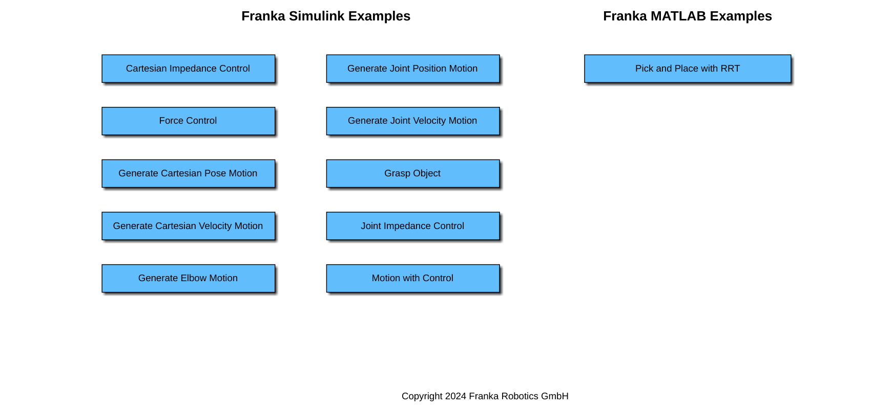
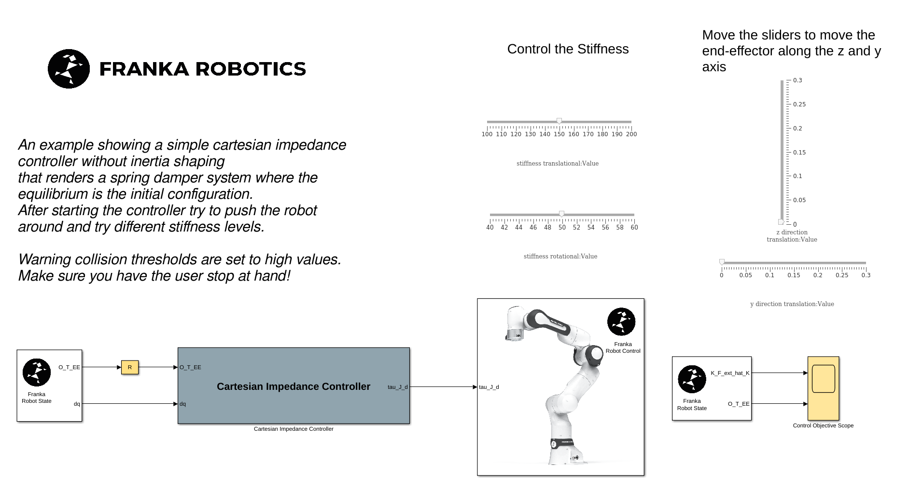
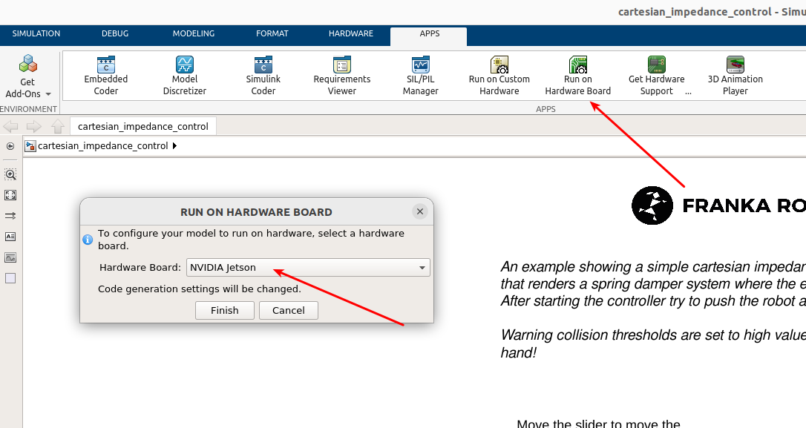
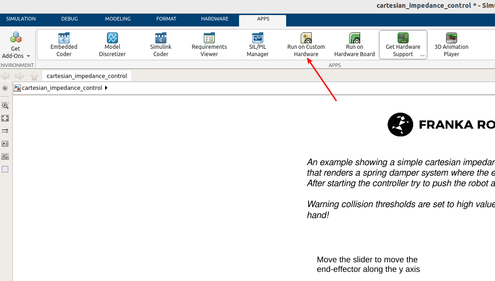
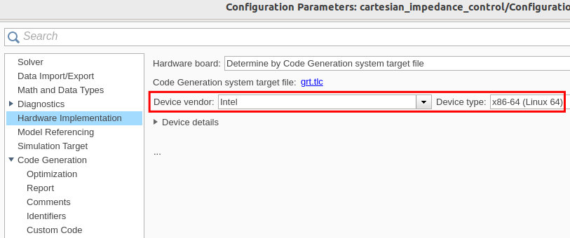

Getting started
===============
.. _getting_started:

Simulink
--------

The Franka MATLAB Toolbox includes a comprehensive set of Simulink and MATLAB examples. These examples are designed to help you understand the toolbox's capabilities and can be customized to meet your project requirements.

To browse the available examples, use the following command:

.. code-block:: matlab

    franka_toolbox_examples();

    Franka Toolbox for MATLAB Examples Navigator.

    The Cartesian Impedance Control Example equiped with sliders as UI elements for controlling the End-Effector position.

After opening, by double clicking, any of the Simulink models the robot settings will be loaded automatically in the 
workspace, in the form of the `frs` object.

.. figure:: _static/workspace_parameters.png
    :align: center
    :figclass: align-center

    The Franka Robot Settings object.

The robot_ip is set to 172.16.0.2. Make sure that the robot_ip, as well as all the other parameters matches your 
setup for your intended purposes.

.. code-block:: matlab

    frs.robot_ip = <your robot ip string>

You can modify the default settings for the FrankaRobotSettings with

.. code-block:: matlab

    edit FrankaRobotSettings.m

Simulink Solver Settings
~~~~~~~~~~~~~~~~~~~~~~~~

The requirements for the solver settings for the Simulink model should be:

* Fixed-step
* discrete (no continuous states)
* With Fixed-step sixe (fundamental sample time) of `0.001`.

Simulink Build & Deploy - Target PC: Franka AI Companion  
~~~~~~~~~~~~~~~~~~~~~~~~~~~~~~~~~~~~~~~~~~~~~~~~~~~~~~~~~

For building & deploying to the Franka AI Companion you can 
use the following recommended workflow:

Start by clicking "Run on Hardware Board" in the Simulink APPS pane and select
the "NVIDIA Jetson" option.

    Run on Hardware Board - Select "NVIDIA Jetson".

.. important::

    In case this option is not visible make sure that the 
    `MATLAB Coder Support Package for NVIDIA Jetson and NVIDIA DRIVE Platforms <https://www.mathworks.com/matlabcentral/fileexchange/68644-matlab-coder-support-package-for-nvidia-jetson-and-nvidia-drive-platforms>`_ 
    is installed.

We need to proceed with a couple of "Hardware Settings" before building & running the model.

.. figure:: _static/hardware_settings.png
    :align: center
    :figclass: align-center

    Select the "Hardware Settings"

Select the "NVIDIA Jetson" Hardware board

Set the `Device Address`, `Username` and `Password` which correspond to your docker instance as it is running in the Franka AI Companion.

.. figure:: _static/board_parameters.png
    :align: center
    :figclass: align-center

    "Board Parameters"

It is recommended to select the "C++11" option in order to ensure compatibility with the MATLAB Coder Support Package for NVIDIA Jetson and NVIDIA DRIVE Platforms.

.. figure:: _static/jetson_config_c++11.png
    :align: center
    :figclass: align-center

    Select the "C++11" option.

.. important::

    For setting the specific port in which the ssh server is exposed by the currently targeted docker
    instance, please excecute the following MATLAB command:

    .. code-block:: shell

        franka_ai_companion_port_switch(<desired port number>);

.. important::

    If you are planning to utilize the External Mode for "Monitoring  & Tuning" make sure
    that you've applied the settings descibed in the section bellow :ref:`external_mode_settings`.

.. important::

    Before executing make sure that the brakes of the robot are disengaged, the FCI mode is activated
    in Desk and that the robot is in execution mode (user-button is released)!

You can now "Build and Deploy" or "Monitor and Tune" for running the Simulink Model!

.. caution::

    The robot will move! Make sure that you are monitoring the situation, ready to take action if necessary!

    "Build & Deploy" or "Monitor & Tune" for enabling the External Mode.

Simulink Build & Deploy - Target PC: Linux Host
~~~~~~~~~~~~~~~~~~~~~~~~~~~~~~~~~~~~~~~~~~~~~~~

.. important::

    If you are planning to build, run & deploy the application to your linux host pc 
    make sure that you've installed libfranka and a Real-Time kernel as described in the 
    previous installation page.

Let's start by selecting the `Run on Custom Hardware` App from the Apps pane in Simulink. 
Allow the grt.tlc target to be auto-selected, as prompted.

    "Run on custom hardware" Simulink App.

Please proceed with the following necessary model checks before proceeding:

 * The Device vendor under "Hardware Implementation" is either "Intel" or "AMD" and device type "x86-64 (Linux 64)".
 * Code interface packaging options is set to "Nonreusable function".

    Hardware Implementation - Device vendor selection.

.. figure:: _static/interface_pane.png
    :align: center
    :figclass: align-center
    :scale: 70%

    "Code interface packaging" options.

.. important::

    If you are planning to utilize the External Mode for "Monitoring  & Tuning" make sure
    that you've applied the settings descibed in the section bellow :ref:`external_mode_settings`.

.. important::

    Before executing make sure that the brakes of the robot are disengaged, the FCI mode is activated
    in Desk and that the robot is in execution mode (user-button is released)!

You can then select from the Hardware tab either `Monitor & Tune` in case monitoring through the external mode is 
desired or `Build, Deploy & Start` for just executing the application without monitoring.

.. figure:: _static/cartesian_impedance_control_hardware.png
    :align: center
    :figclass: align-center

    Hardware Simulink App.

.. caution::

    The robot will move! Make sure that you are monitoring the situation, ready to take action if necessary!

.. _external_mode_settings:

Simulink External Mode ("Monitor & Tune") - Necessary Settings
~~~~~~~~~~~~~~~~~~~~~~~~~~~~~~~~~~~~~~~~~~~~~~~~~~~~~~~~~~~~~~

In case you are planning to execute with External Mode for "Monitor & Tuning", 
it is also necessary to apply the following settings:

 * "Run external mode in a background thread".
 * The Code interface packaging is "Nonreusable function".
 * "MAT-file logging" is unchecked.

    "Run external mode in a background thread" is necessary so that the 1kHz loop won't get disturbed

.. figure:: _static/model_settings_interface_non_reusable_function.png
    :align: center
    :figclass: align-center
    :scale: 70%

    "Nonreusable function option is required for building with External-Mode

.. figure:: _static/model_settings_interface_mat_file_logging.png
    :align: center
    :figclass: align-center
    :scale: 50%

    "MAT-file logging" should be unchecked unchecked for building with External-Mode"

MATLAB
------

Demo Pick & Place with RRT 
~~~~~~~~~~~~~~~~~~~~~~~~~~

For familiarization with the Matlab API for the Franka Robot the `pick_and_place_with_RRT.mlx` demo is a good starting point. 

.. figure:: _static/matlab_pick_and_place_with_RRT_demo.png
    :align: center
    :figclass: align^center

    Live Matlab Script and Figure of the pick^and^place demo.

Automatic error recovery
~~~~~~~~~~~~~~~~~~~~~~~~
If the robot encounters an error state and transitions to reflex mode, 
you may attempt a recovery by executing the automatic error recovery command in Matlab.

.. code-block:: shell

    fr = FrankaRobot('RobotIP', <robot ip as string>);
    fr.automatic_error_recovery();

In case the command fails and the robot remains in the erroneous state try using the guiding mode to manually bring 
back the robot to a valid configuration. 

.. hint::

    Checkout the :ref:`Franka library for MATLAB <matlab-library>` for a set of helper 
    functions that can help to optimize your workflow.

