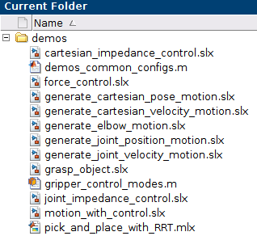

Getting started
===============

Overview
--------

In the demos folder a set of Simulink examples with various implementations is located. Feel free to experiment, adjust 
them and expand them to fit your project needs!

    Simulink Demos in franka_matlab.

Initialization
--------------

After opening, double clicking on any of the simulink models a set of parameters will be loaded automatically in the 
workspace.

.. hint::

    The Simulink models are delivered in R2019a version. They will convert automatically to your Matlab version 
    when you try to save the model. 

.. figure:: _static/workspace_parameters.png
    :align: center
    :figclass: align-center

    Working space after loading a Simulink demo.

The robot_ip is set to 172.16.0.2 by default after loading the demos. Make sure that the robot_ip parameters matches your 
setup, either by modifying it in the `demos/demos_common_config.m` matlab script file or from the cmd line after the 
simulink demo is loaded, like:

.. code-block:: shell

    >> robot_ip = <your robot ip string>

At this point we can start the building & deployment of the Simulink model.

Execution
---------

.. hint::

    The current workflow presented is utilizing the "Run on Custom Hardware" Simulink App, present in Matlab versions
    :math:`\geq` R2020a. In case of Matlab 2019a you can build the model normaly by using the "Build Model" button.
    You then need to run the executable from a terminal as described bellow.

Let's start by selecting the `Run on custom hardware` App from the Apps pane in Simulink.

.. figure:: _static/simulink_apps_pane.png
    :align: center
    :figclass: align-center

    Run on custom hardware Simulink App.

.. important::

    Before executing make sure that the brakes of the robot are disengaged and that the robot is in execution mode!

You can then select from the Hardware tab either `Monitor & Tune` in case monitoring through the external mode is 
desired or `Build, Deploy & Start` for just executing the application without monitoring.

.. figure:: _static/simulink_hardware_pane.png
    :align: center
    :figclass: align-center

    Hardware Simulink App.

For running the generated executable manually from a terminal make sure that you've first exported the full libfranka 
build path, in case of Linux:

.. code-block:: shell

    >> $ export LD_LIBRARY_PATH=$LD_LIBRARY_PATH:<libfranka build folder full path>

or in case of Windows, that you've included the full path of libfranka build directory in the PATH environment variable.

.. hint::

    As a reminder, in case of a robot with system version 4.2.0 or greater, the FCI control mode needs to be explicitly enabled through Desk --> Sidebar menu --> Activate FCI. 

.. caution::

    The robot will move! Make sure that you are monitoring the situation, ready to take action if necessary!

You can then run the executable, which is located in the current working space. 

In case of Linux:

.. code-block:: shell

    $ ./<simulink_model_name>

or in case of Windows:

.. code-block:: shell

    > <simulink_model_name>.exe

You can manually choose the simple tcpip from the Simulink model settings.

Automatic error recovery
------------------------

.. figure:: _static/simulink_view_diagnostics.png
    :align: center
    :figclass: align-center

    View diagnostic messages during runtime in Simulink.

.. figure:: _static/simulink_view_errors.png
    :align: center
    :figclass: align-center

    View error messages in Simulink.

.. figure:: _static/matlab_command_window_error_message.png
    :align: center
    :figclass: align-center

    Error message displayed in Matlab Command Window.

.. figure:: _static/terminal_error_message.png
    :align: center
    :figclass: align-center

    Error message displayed in terminal in case of manual execution.

In case the robot reaches an error state you can try to recover by running the `franka_automatic_error_recovery` matlab command:

.. code-block:: shell

    >> franka_automatic_error_recovery(<robot ip string>);

In case the command fails and the robot remains in the erroneous state try using the guiding mode to manually bring 
back the robot to a valid configuration. 

.. hint::

    Checkout the :ref:`matlab library <matlab-library>` for a set of helper 
    functions that can help to optimize your workflow.
