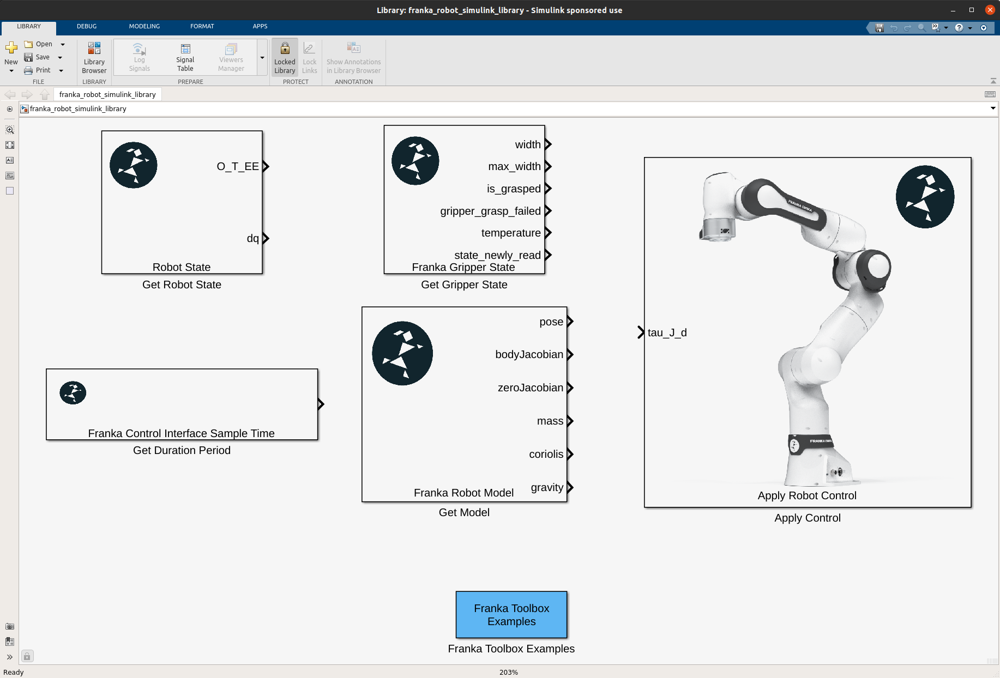

Franka MATLAB Toolbox
======================

.. todolist::

Franka MATLAB Toolbox contains a set of libraries and tools for exposing the Franka Robot to the Mathworks ecosystem with the:

* ``Simulink Franka Library``, a set of simulink blocks interfacing the Franka Robot through automatic C++ code gen with Simulink Coder, for rapid-prototyping of robot control algorithms.

    Simulink Library for rapid-prototyping of controllers for the Franka robot.

* ``Matlab Franka Library``, a set of matlab functions for reading the current robot state and applying some simple open loop motion commands.

.. toctree::
   :maxdepth: 2
   :caption: Contents:

   matlab_toolbox_dependencies
   compatibility
   installation
   getting_started
   simulink_library
   matlab_library
   troubleshooting
