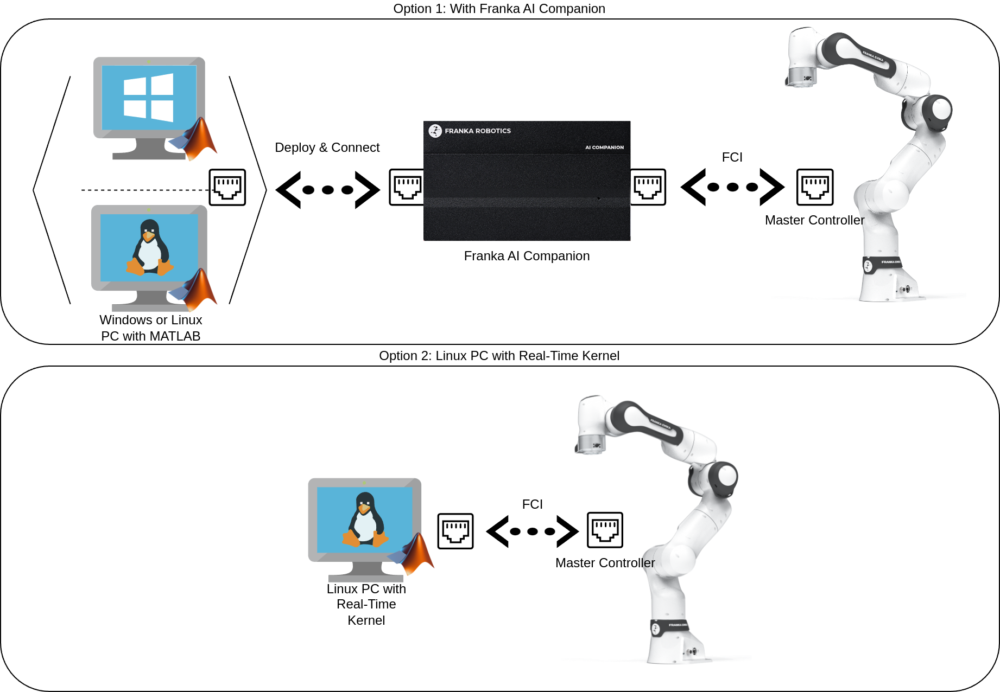

Franka Toolbox for MATLAB
=========================

.. todolist::

The Franka Toolbox for MATLAB contains a set of libraries and tools for exposing the Franka Robot to the Mathworks software ecosystem.

    Hardware/Software configuration options for the Franka Toolbox for MATLAB.

The Toolbox consists of the:

* ``Franka Library for Simulink``, a set of Simulink blocks for interfacing the Franka Robot through automatic C++ code gen with Simulink Coder. The library mainly aims at assisting with the rapid-development of advanced robot controllers.

.. figure:: _static/simulink_library_browser.png
    :align: center
    :figclass: align-center

    Simulink Library for rapid-prototyping of controllers for the Franka Robot.

and the:

* ``Franka Library for MATLAB``, which provides the `FrankaRobot()` MATLAB class for directly interfacing the Franka Robot.

.. figure:: _static/matlab_pick_and_place_with_RRT_demo.png
    :align: center
    :figclass: align-center

    The Live Matlab Script implementation of the "pick-and-place with RRT" example as provided with the Franka Toolbox for MATLAB.

.. toctree::
   :maxdepth: 2
   :caption: Contents:

   matlab_toolbox_dependencies
   compatibility
   installation
   getting_started
   simulink_library
   matlab_library
   troubleshooting
