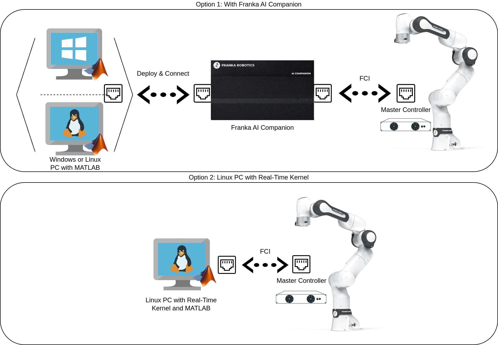
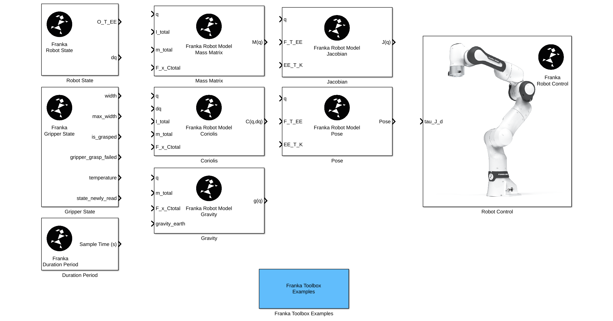

Franka Toolbox for MATLAB
=========================

.. todolist::

The Franka Toolbox for MATLAB contains a set of libraries and tools for exposing the Franka Robot to the Mathworks software ecosystem.

    Hardware/Software configuration options for the Franka Toolbox for MATLAB.

.. hint::
    The Simulink implementations with the Franka MATLAB Toolbox can be readily built and deployed 
    to the Franka AI Companion, by both Linux and Windows host PCs. Generic NVIDIA's Jetson Hardware boards
    are also supported, given that they are equiped with a `Real-Time kernel Package <https://docs.nvidia.com/jetson/archives/r35.1/DeveloperGuide/text/SD/Kernel/KernelCustomization.html#using-the-jetson-linux-real-time-kernel-package>`_ and a system-wide libfranka
    installation.

The Toolbox consists of the:

* ``Franka Library for Simulink``, a set of Simulink blocks for interfacing the Franka Robot through automatic C++ code gen with Simulink Coder. The library mainly aims at assisting with the rapid-development of advanced robot controllers.

    Simulink Library for rapid-prototyping of controllers for the Franka Robot.

and the:

* ``Franka Library for MATLAB``, which provides the `FrankaRobot()` MATLAB class for directly interfacing the Franka Robot.

.. figure:: _static/matlab_pick_and_place_with_RRT_demo.png
    :align: center
    :figclass: align-center

    The Live Matlab Script implementation of the "pick-and-place with RRT" example as provided with the Franka Toolbox for MATLAB.

.. toctree::
   :maxdepth: 2
   :caption: Contents:

   matlab_toolbox_dependencies
   compatibility
   installation
   getting_started
   simulink_library
   matlab_library
   troubleshooting
