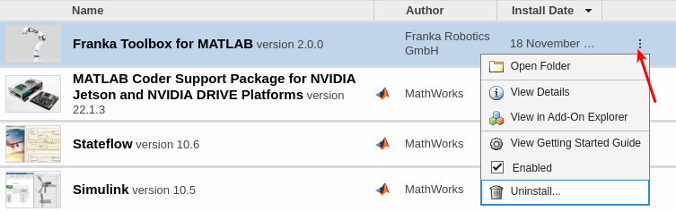

Installation
============

Installation Methods
--------------------

Option 1: Direct Installation
^^^^^^^^^^^^^^^^^^^^^^^^^^^^^
Drag and drop the ``franka_toolbox.mltbx`` file into your MATLAB Command Window and follow the installation prompts.

Option 2: Programmatically
^^^^^^^^^^^^^^^^^^^^^^^^^^
.. code-block:: matlab

    uiopen('<path to your franka.mltbx file>', 1);

License Management & Activation
-------------------------------

1. Generate System Identifier
^^^^^^^^^^^^^^^^^^^^^^^^^^^^^
Execute the following command in MATLAB to generate your system's unique identifier:

.. code-block:: matlab

    franka_toolbox_uid_gen()

2. Obtain License
^^^^^^^^^^^^^^^^^
Contact Franka Robotics with your generated identifier to receive your license number.

3. Activate License
^^^^^^^^^^^^^^^^^^^
For Franka Research 3 robots:

.. code-block:: matlab

    franka_toolbox_install('<your_license_number>');

or for first-generation `FER` robots:

.. code-block:: matlab

    franka_toolbox_install('<your_license_number>', 'fer');

Uninstall Toolbox
-----------------

1. Clean-up local permanent installation artifacts:

.. code-block:: matlab

    franka_toolbox_uninstall();

2. Remove the toolbox using MATLAB Add-Ons Manager.

    Uninstalling the Franka Toolbox.

.. _libfranka_handling_options:

libfranka handling options for Target PC
----------------------------------------

libfranka pre-built binaries
^^^^^^^^^^^^^^^^^^^^^^^^^^^^

Starting with Franka Toolbox for MATLAB version 2.0.0, libfranka is included in the toolbox distribution.

There are dynamic dependencies for the precompiled libfranka on the Target PC, which need to be installed on the Target PC:

1. :ref:`precompiled libfranka system dependencies for AI Companion<system_dependencies_precompiled_ai_companion>` section.
2. :ref:`precompiled libfranka system dependencies for RT Linux Host<system_dependencies_precompiled_rt_linux_host>` section.   

libfranka local (Toolbox scope) installation
^^^^^^^^^^^^^^^^^^^^^^^^^^^^^^^^^^^^^^^^^^^^

In case the system dependencies for the precompiled libfranka cannot be met, or if in case there are issues with the precompiled binaries, you can build and install libfranka from source, locally in the scope of the Franka Toolbox only.

Start by installing the dependencies for the libfranka build:

.. code-block:: bash

    sudo apt remove "*libfranka*"
    sudo apt install build-essential cmake git libpoco-dev libeigen3-dev

Then the whole process can be handled automatically by the toolbox. 

You can execute the following command in MATLAB to start the auto-installation for the AI Companion:

.. code-block:: matlab

    franka_toolbox_libfranka_install_remote(<'0.9.2' | '0.14.0'>,'<user name>','<IP address>','<Port number (optional)>');

or in case of an RT Linux Host:

.. code-block:: matlab

    franka_toolbox_libfranka_install(<'0.9.2' | '0.14.0'>, true);

libfranka system-wide installation
^^^^^^^^^^^^^^^^^^^^^^^^^^^^^^^^^^

libfranka can be also installed manually system-wide on the Target PC. For more details, please refer to the `libfranka README <https://github.com/frankaemika/libfranka/blob/main/README.md>`_.

In case you prefer to build against the system-wide libfranka installation, you can do so by executing:

.. code-block:: matlab

    franka_toolbox_libfranka_system_installation_set(true);

This will trigger the toolbox to build against the system-wide libfranka installation.

For reverting back to the local installation in the scope of the toolbox, you can execute:

.. code-block:: matlab

    franka_toolbox_libfranka_system_installation_set(false);
