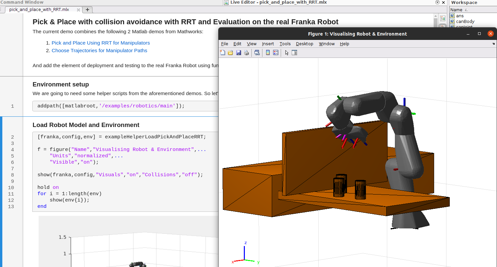

.. _matlab-library:

Matlab Library
==============

Matlab Demo Pick & Place with RRT 
---------------------------------

For familiarization with the Matlab API for the Franka Robot the `pick_and_place_with_RRT.mlx` demo is a good starting point. 

    Live Matlab Script and Figure of the pick-and-place demo.

.. hint::
    The pick-and-place demo requires the `Matlab Robotics Toolbox <https://www.mathworks.com/products/robotics.html>`_ with Matlab :math:`\geq` R2021b.

FrankaRobot Class
-----------------

.. code-block:: shell

    >> fr = FrankaRobot(<robot ip string>);

Automatic Error Recovery
^^^^^^^^^^^^^^^^^^^^^^^^

.. code-block:: shell

    >> fr.automatic_error_recovery();

Will attempt an automatic error recovery .

Get Joint Poses
^^^^^^^^^^^^^^^

.. code-block:: shell

    >> jp = fr.joint_poses();

Will return a 7 element cell array with the current robot joint poses.

Get Robot State
^^^^^^^^^^^^^^^

.. code-block:: shell

    >> rs = fr.robot_state();

Will return a struct will the current robot state.

Joint Point to Point Motion
^^^^^^^^^^^^^^^^^^^^^^^^^^^

.. code-block:: shell

    >> fr.joint_point_to_point_motion(<7 element double array with target configuration>, <0 to 1 scalar speed factor>);

Will move the robot into a desired joint configuration.

Joint Trajectory Motion
^^^^^^^^^^^^^^^^^^^^^^^^

.. code-block:: shell

    >> fr.joint_trajectory_motion(<7xn double array with desired joint trajectory>);

Will move the robot based on the given desired joint trajectory.

.. warning::
    Make sure that the current configuration of the robot maches the initial trajectory element `q(1:7,1)` that is passed in the function! Additionally make sure that
    the given trajectory is sufficiently smooth and continuous.

Gripper State
^^^^^^^^^^^^^

.. code-block:: shell

    >> gs = fr.gripper_state();

Will return a struct with the current gripper state.

Gripper Homing
^^^^^^^^^^^^^^

.. code-block:: shell

    >> fr.gripper_homing();

Will perform a homing operation to the gripper and will return 1 if succesful.

Gripper Grasp
^^^^^^^^^^^^^

.. code-block:: shell

    >> fr.ripper_grasp(width, speed, force, epsilon_inner, epsilon_outer);

Will attempt a grasp and will return 1 if the object is grasped, 0 otherwise.

Gripper Move
^^^^^^^^^^^^

.. code-block:: shell

    >> fr.gripper_move(width,speed);

Will move the gripper to a desired width position. Will return 1 if succesful, 0 otherwise.

Gripper Stop
^^^^^^^^^^^^

.. code-block:: shell

    >> fr.gripper_stop();

Will stop the current gripper operation. Will return 1 if succesful, 0 otherwise.