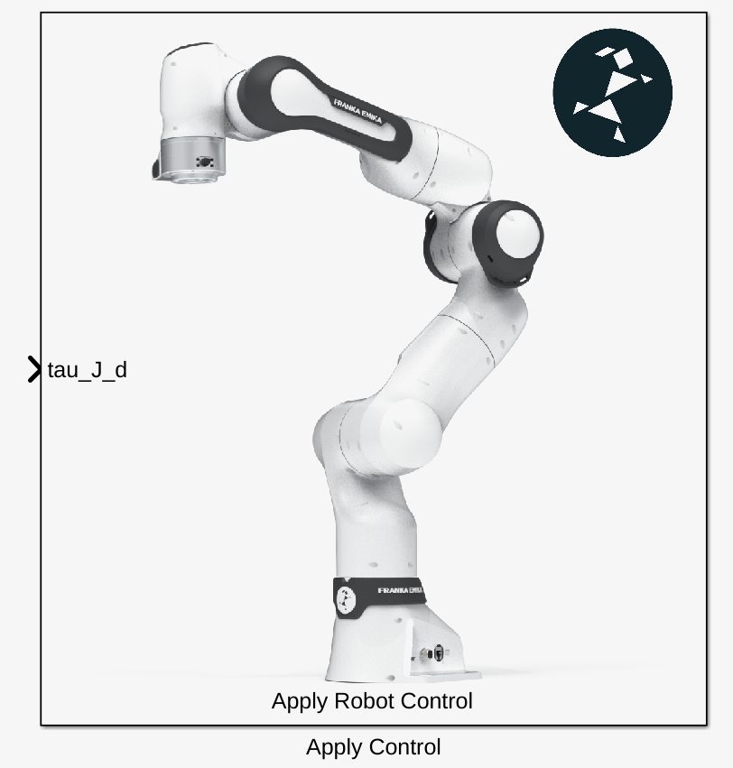
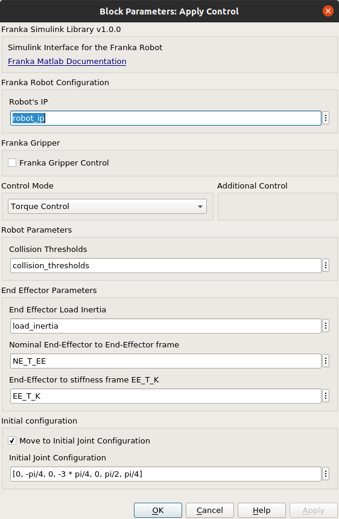
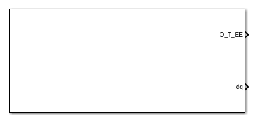
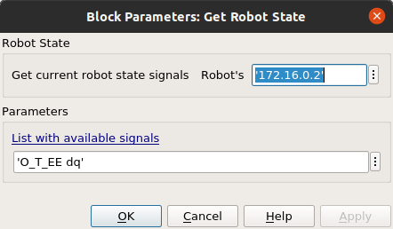
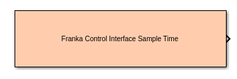
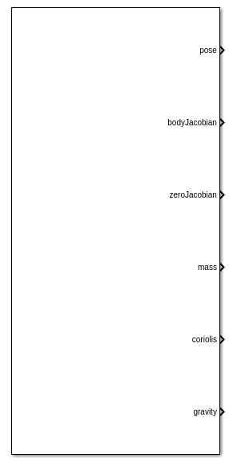
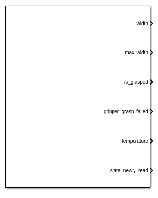

Simulink Library
================

.. hint::
    Regarding the inputs/outputs signals nomenclature datatypes and sizes the libfranka definitions
    have been fully adopted. You can check the list of signals here -->
    `Robot State Attributes <https://frankaemika.github.io/libfranka/0.14.2/structfranka_1_1RobotState.html>`_.
    Column-major format for the signal has been adopted as well.

Apply Control
-------------

    Apply Control Simulink Block.

This is the main block of the franka simulink library and it is responsible for applying the desired parameters and
control signals to the robot.

Additionally a set of parameters for the robot can be applied through this block main pane based mostly
on the desired control mode that is selected from the drop-down list `Control Mode`.

    Apply Control Simulink Block Settings.

.. hint::
    If desirable, an initial robot configuration can be applied **!!before!!** the main execution of the control loop.
    Namely the robot will move to the desirable configuration and only then the main execution of the Simulink model
    will take place. You can define that in the `Initial Configuration` section of the block settings.

Get Robot State
-----------------------

    Get Robot State Simulink Block.

You can write the signals that you wish to capture in free text form in the `Parameters` section.
For the set of available signals --> `Robot State Attributes <https://frankaemika.github.io/libfranka/0.14.2/structfranka_1_1RobotState.html>`_

    Get initial robot state Simulink Block Settings.

Get Duration(Sample Time)
-------------------------

    Get duration from last main callback(Sample Time) Simulink Block.

This Simulink block outputs the duration from the last execution step in seconds. Ideally this should be always
0.001 seconds but due to lost packages during communication errors 0.002 secs or 0.003 secs could be seen.

.. warning::
    The step count of the Simulink model **does not change** during these communication mishaps!
    It just continues incrementally although an execution step in reality has been lost!
    Special design considerations should be therefore demanded especially in the case of
    sensitive position motion generators.
    Have a look to e.g the generate_cartesian_pose_motion.slx demo to see how the
    main "clock" of the application has been designed.

Get Model
---------

    Get robot model numeric values Simulink Block.

This Simulink block will deliver the numerical values of the Model of the Franka robot. For an analytical
description of the available signals see -->
`Robot Model Signals <https://frankaemika.github.io/libfranka/0.14.2/classfranka_1_1Model.html>`_

Get Gripper State
-----------------

    Get current gripper state Simulink Block.

The get gripper state block will inform the application about the current gripper state.

.. hint::
    Highly recommended to have a look at the
    `GripperState Struct Reference <https://frankaemika.github.io/libfranka/0.14.2/structfranka_1_1GripperState.html>`_
    for the list of available signals and the demo `grasp_objects.slx` which is provided for getting started.
