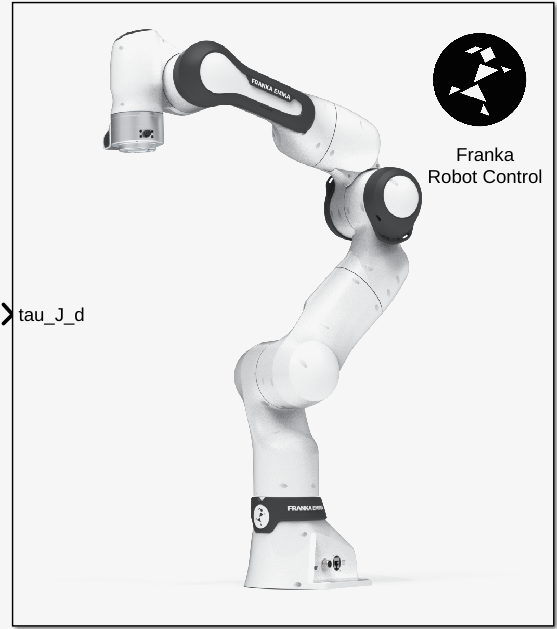
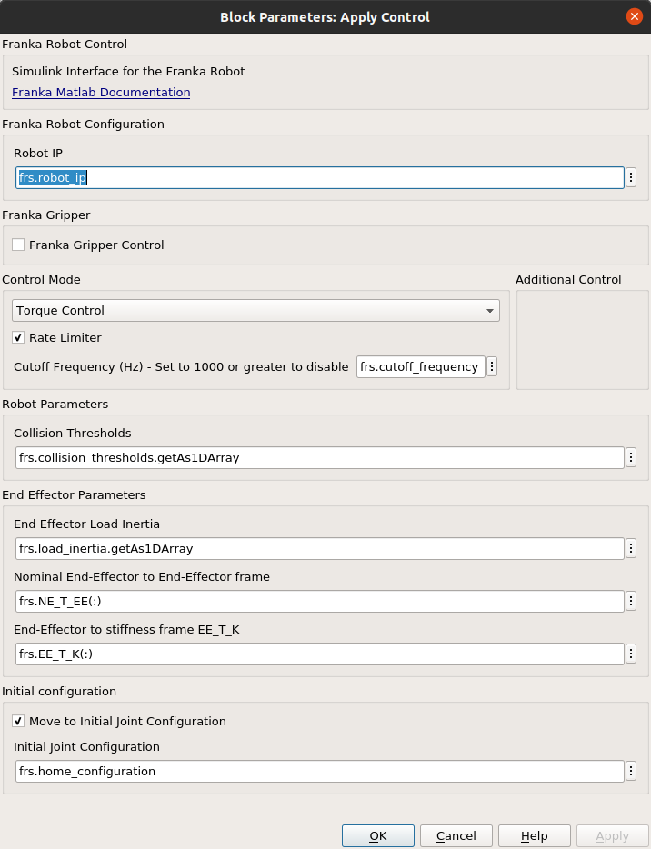
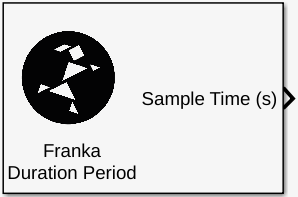
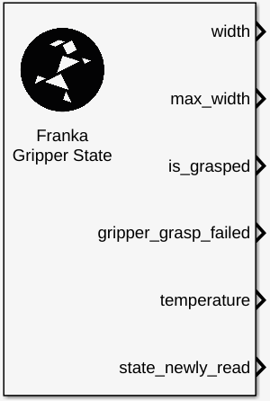
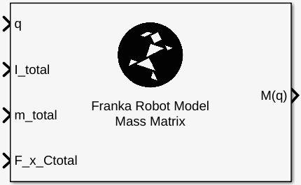
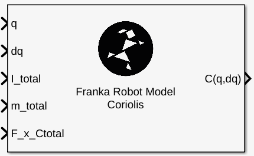
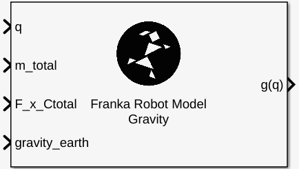
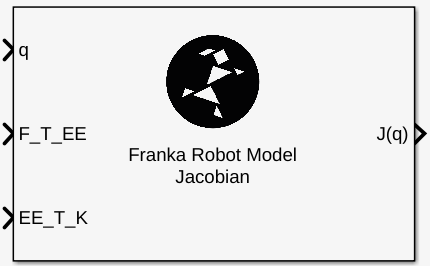
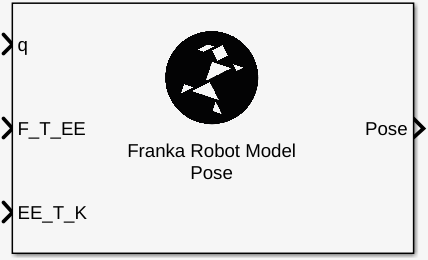

Fanka Library for Simulink - Reference
======================================

.. hint::
    Regarding the inputs/outputs signals nomenclature datatypes and sizes the libfranka definitions 
    have been fully adopted. You can check the list of signals here --> 
    `Robot State Attributes <https://frankaemika.github.io/libfranka/structfranka_1_1RobotState.html>`_. 
    Column-major format for the signal has been adopted as well.

Robot Control
-------------

    Robot Control Simulink Block.

This is the main block of the Franka Simulink Library and it is responsible for applying the desired robot parameters and  
control signals to the robot. 

The robot settings can be applied through the block parameters.

    Robot Control Simulink Block Settings.

.. hint:: 
    If desirable, an initial robot configuration can be applied **!!before!!** the main execution of the control loop. 
    Namely the robot will move to the desirable configuration and only then the main execution of the Simulink model
    will take place. You can define that in the `Initial Configuration` section of the block settings. 

Robot State
-----------

.. figure:: _static/get_robot_state.png
    :align: center
    :figclass: align-center

    Robot State Simulink Block.

For reading the desired set of signals steming from the current robot state, 
you can free-type the names of the signals in the `Parameters` pane of the block parameters. 
For the set of available signals and their namings --> `Robot State Attributes <https://frankaemika.github.io/libfranka/structfranka_1_1RobotState.html>`_

.. figure:: _static/get_robot_state_settings.png
    :align: center
    :figclass: align-center

    Get initial robot state Simulink Block Settings.

Duration Period
---------------

    Get duration from last main callback(Sample Time) Simulink Block.

This Simulink block outputs the duration from the last execution step in seconds. Ideally this should be always
0.001 seconds but due to lost packages during communication errors 0.002 secs or 0.003 secs could be seen.

.. warning:: 
    The step count of the Simulink model **does not change** during these communication mishaps! 
    It just continues incrementally although an execution step in reality has been lost!
    Special design considerations should be therefore demanded especially in the case of 
    sensitive position motion generators.
    Have a look to e.g the generate_cartesian_pose_motion.slx demo to see how the 
    main "clock" of the application has been designed.

Gripper State
-------------

    Get current gripper state Simulink Block.

The gripper state block will inform the application about the current gripper state. 

.. hint::
    Highly recommended to have a look at the 
    `GripperState Struct Reference <https://frankaemika.github.io/libfranka/structfranka_1_1GripperState.html>`_ 
    for the list of available signals and the demo `grasp_objects.slx` which is provided for getting started.

Mass Matrix
-----------

    Get the Mass Matrix of the Robot Model. 

Coriolis
--------

    Get the Coriolis Matrix of the Robot Model.

Gravity
-------

    Get the Gravity Vector of the Robot Model.

Jacobian
--------

    Get the Jabobian Matrix of the Robot.

You can select between "zero" or "body" Jacobian as well as the desired 
frame inside the block parameters.

Pose
----

    Get the Robot Pose.

You can select the desired pose frame inside the block parameters.