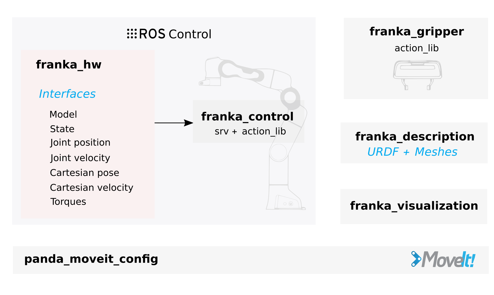

franka_ros
==========
.. note::

 ``franka_ros`` is not supported on Windows.

Before continuing with this chapter, please :doc:`install or compile franka_ros <installation_linux>`.

    Schematic overview of the ``franka_ros`` packages.

The ``franka_ros`` metapackage integrates ``libfranka`` into ROS and ROS control.
Here, we introduce its packages and
we also give a short how-to for :ref:`writing controllers <write_own_controller>`.

All parameters passed to launch files in this section come with default values, so they
can be omitted if using the default network addresses and ROS namespaces.
Make sure the ``source`` command was called with the setup script from your workspace:

.. code-block:: shell

   source /path/to/catkin_ws/devel/setup.sh

franka_description
------------------

This package contains the description of our robots and end effectors in terms of kinematics, joint
limits, visual surfaces and collision space. The collision space is a simplified version of the
visual description used to improve performance of collision checks. The descriptions are based on
the URDF format according to the `URDF XML documentation <http://wiki.ros.org/urdf/XML>`_ .

In case you want to simulate the Panda robot, you can pass a ``gazebo`` argument to the XACRO file.
Then the URDF will contain *estimated* inertias values, i.e. link masses and inertia tensors based
on the `Dynamic Identification of the Franka Emika Panda Robot With Retrieval of Feasible Parameters Using
Penalty-Based Optimization <https://hal.inria.fr/hal-02265293/file/IROS_19_Panda.pdf>`_.

.. code-block:: shell

   xacro $(rospack find franka_description)/robots/panda_arm.urdf.xacro gazebo:=true

.. _franka_gripper:

franka_gripper
--------------
This package implements the ``franka_gripper_node`` for interfacing a gripper from ROS.
The node publishes the state of the gripper and offers the following `actions servers`:

 * ``franka_gripper::MoveAction(width, speed)``: moves to a target `width` with the defined
   `speed`.
 * ``franka_gripper::GraspAction(width, epsilon_inner, epsilon_outer, speed, force)``: tries to
   grasp at the desired `width` with a desired `force` while closing with the given `speed`. The
   operation is successful if the distance :math:`d` between the gripper fingers is:
   :math:`\text{width} - \epsilon_\text{inner} < d < \text{width} + \epsilon_\text{outer}`.
 * ``franka_gripper::HomingAction()``: homes the gripper and updates the maximum width given the
   mounted fingers.
 * ``franka_gripper::StopAction()``: aborts a running action. This can be used to stop applying
   forces after grasping.
 * ``control_msgs::GripperCommandAction(width, max_effort)``: A standard gripper action
   recognized by MoveIt!.

You can launch the ``franka_gripper_node`` with:

.. code-block:: shell

    roslaunch franka_gripper franka_gripper.launch robot_ip:=<fci-ip>

.. hint::

    Starting with ``franka_ros`` 0.6.0, specifying ``load_gripper:=true`` for
    ``roslaunch franka_control franka_control.launch`` will start a ``franka_gripper_node`` as well.

.. _franka_hw:

franka_hw
---------
This package contains the hardware abstraction of the robot for the ROS control framework
based on the ``libfranka`` API. The hardware class ``franka_hw::FrankaHW`` is implemented in this
package offering the following interfaces to controllers:

+-------------------------------------------------+----------------------------------------------+
|                    Interface                    |                   Function                   |
+=================================================+==============================================+
| ``hardware_interface::JointStateInterface``     | Reads joint states.                          |
+-------------------------------------------------+----------------------------------------------+
| ``hardware_interface::VelocityJointInterface``  | Commands joint velocities and reads joint    |
|                                                 | states.                                      |
+-------------------------------------------------+----------------------------------------------+
| ``hardware_interface::PositionJointInterface``  | Commands joint positions and reads joint     |
|                                                 | states.                                      |
+-------------------------------------------------+----------------------------------------------+
| ``hardware_interface::EffortJointInterface``    | Commands joint-level torques and reads       |
|                                                 | joint states.                                |
+-------------------------------------------------+----------------------------------------------+
| ``franka_hw::FrankaStateInterface``             | Reads the full robot state.                  |
+-------------------------------------------------+----------------------------------------------+
| ``franka_hw::FrankaPoseCartesianInterface``     | Commands Cartesian poses and reads the full  |
|                                                 | robot state.                                 |
+-------------------------------------------------+----------------------------------------------+
| ``franka_hw::FrankaVelocityCartesianInterface`` | Commands Cartesian velocities and reads the  |
|                                                 | full robot state.                            |
+-------------------------------------------------+----------------------------------------------+
| ``franka_hw::FrankaModelInterface``             | Reads the dynamic and kinematic model of the |
|                                                 | robot.                                       |
+-------------------------------------------------+----------------------------------------------+

To use ROS control interfaces, you have to retrieve resource handles by name:

+-------------------------------------------------+----------------------------------------+
|                    Interface                    |          Resource handle name          |
+=================================================+========================================+
| ``hardware_interface::JointStateInterface``     | "<arm_id>_joint1" to "<arm_id>_joint7" |
+-------------------------------------------------+----------------------------------------+
| ``hardware_interface::VelocityJointInterface``  | "<arm_id>_joint1" to "<arm_id>_joint7" |
+-------------------------------------------------+----------------------------------------+
| ``hardware_interface::PositionJointInterface``  | "<arm_id>_joint1" to "<arm_id>_joint7" |
+-------------------------------------------------+----------------------------------------+
| ``hardware_interface::EffortJointInterface``    | "<arm_id>_joint1" to "<arm_id>_joint7" |
+-------------------------------------------------+----------------------------------------+
| ``franka_hw::FrankaStateInterface``             | "<arm_id>_robot"                       |
+-------------------------------------------------+----------------------------------------+
| ``franka_hw::FrankaPoseCartesianInterface``     | "<arm_id>_robot"                       |
+-------------------------------------------------+----------------------------------------+
| ``franka_hw::FrankaVelocityCartesianInterface`` | "<arm_id>_robot"                       |
+-------------------------------------------------+----------------------------------------+
| ``franka_hw::FrankaModelInterface``             | "<arm_id>_robot"                       |
+-------------------------------------------------+----------------------------------------+

.. hint::

    By default, <arm_id> is set to "panda".

The ``franka_hw::FrankaHW`` class also implements the starting, stopping and switching of
controllers.

The ``FrankaHW`` class also serves as base class for ``FrankaCombinableHW``, a hardware class that
can be combined with others to control multiple robots from a single controller. The combination of
an arbitrary number of Panda robots (number configured by parameters) based on ``FrankaCombinableHW``
for the ROS control framework `<https://github.com/ros-controls/ros_control>`_ is implemented
in ``FrankaCombinedHW``. The key-difference between ``FrankaHW`` and ``FrankaCombinedHW`` is
that the latter supports torque control only.

.. important::

  The ``FrankaCombinableHW`` class is available from version 0.7.0 and allows torque/effort control only.

The ROS parameter server is used to determine at runtime which robots are loaded in the combined
class. For an example on how to configure the ``FrankaCombinedHW`` in the according hardware node,
see :ref:`franka_control <franka_control>`.

.. note::

   The approach of ``FrankaHW`` is optimal for controlling single robots. Thus we recommend using
   the ``FrankaCombinableHW``/``FrankaCombinedHW`` classes only for controlling multiple robots.

The interfaces offered by the ``FrankaCombinableHW``/``FrankaCombinedHW`` classes are the following:

+-------------------------------------------------+----------------------------------------------+
|                    Interface                    |                   Function                   |
+=================================================+==============================================+
| ``hardware_interface::EffortJointInterface``    | Commands joint-level torques and reads       |
|                                                 | joint states.                                |
+-------------------------------------------------+----------------------------------------------+
| ``hardware_interface::JointStateInterface``     | Reads joint states.                          |
+-------------------------------------------------+----------------------------------------------+
| ``franka_hw::FrankaStateInterface``             | Reads the full robot state.                  |
+-------------------------------------------------+----------------------------------------------+
| ``franka_hw::FrankaModelInterface``             | Reads the dynamic and kinematic model of the |
|                                                 | robot.                                       |
+-------------------------------------------------+----------------------------------------------+

The only admissible command interface claim is the ``EffortJointInterface`` which can be combined
with any set of read-only-interfaces (``FrankaModelInterface``, ``JointStateInterface``,
``FrankaStateInterface``). The resource handles offered by all interfaces are claimed by name and
follow the same naming conventions as described for `FrankaHW`. Every instance of
``FrankaCombinableHW`` offers the complete set of service and action interfaces
(see :ref:`franka_control <franka_control>`).

.. note::

   The ``FrankaCombinedHW`` class offers an additional action server in the control node namespace
   to recover all robots. If a reflex or error occurs on any of the robots, the control loop of all
   robots stops until they are recovered.

.. important::

    ``FrankaHW`` makes use of the ROS `joint_limits_interface <http://wiki.ros.org/ros_control#Joint_limits_interface>`_
    to `enforce position, velocity and effort safety limits
    <http://wiki.ros.org/pr2_controller_manager/safety_limits>`_.
    The utilized interfaces are listed below:

     * joint_limits_interface::PositionJointSoftLimitsInterface
     * joint_limits_interface::VelocityJointSoftLimitsInterface
     * joint_limits_interface::EffortJointSoftLimitsInterface

    Approaching the limits will result in the (unannounced) modification of the commands.

.. _franka_control:

franka_control
--------------

The ROS nodes ``franka_control_node`` and ``franka_combined_control_node`` are hardware nodes
for ROS control that use according hardware classes from ``franka_hw``. They provide a variety
of ROS services to expose the full ``libfranka`` API in the ROS ecosystem. The following services
are provided:

 * ``franka_msgs::SetJointImpedance`` specifies joint stiffness for the internal controller
   (damping is automatically derived from the stiffness).
 * ``franka_msgs::SetCartesianImpedance`` specifies Cartesian stiffness for the internal
   controller (damping is automatically derived from the stiffness).
 * ``franka_msgs::SetEEFrame`` specifies the transformation from <arm_id>_EE (end effector) to
   <arm_id>_NE (nominal end effector) frame. The transformation from flange to end effector frame
   is split into two transformations: <arm_id>_EE to <arm_id>_NE frame and <arm_id>_NE to
   <arm_id>_link8 frame. The transformation from <arm_id>_NE to <arm_id>_link8 frame can only be
   set through the administrator's interface.
 * ``franka_msgs::SetKFrame`` specifies the transformation from <arm_id>_K to <arm_id>_EE frame.
 * ``franka_msgs::SetForceTorqueCollisionBehavior`` sets thresholds for external Cartesian
   wrenches to configure the collision reflex.
 * ``franka_msgs::SetFullCollisionBehavior`` sets thresholds for external forces on Cartesian
   and joint level to configure the collision reflex.
 * ``franka_msgs::SetLoad`` sets an external load to compensate (e.g. of a grasped object).
 * ``std_srvs::Trigger`` services allow to connect and disconnect your hardware node
   (available from 0.8.0). When no active (commanding) controller is running, you can disconnect
   the hardware node, freeing the respective robots for non-fci applications like e.g. Desk-based
   operations. Once you want to resume fci operations you can call connect and start your
   ros_control based controllers again.

.. important::

    The <arm_id>_EE frame is a child of the <arm_id>_NE frame and denotes the part of the
    configurable end effector frame which can be adjusted during run time through `franka_ros`. The
    <arm_id>_K frame is a child frame of <arm_id>_EE and marks the center of the internal
    Cartesian impedance. It also serves as a reference frame for external wrenches. *Neither the
    <arm_id>_EE nor the <arm_id>_K are contained in the URDF as they can be changed at run time*.
    By default, <arm_id> is set to "panda".

To recover from errors and reflexes the ``franka_msgs::ErrorRecoveryAction`` can be called.
That can be done from an action client or by simply publishing on the action goal topic:

.. code-block:: shell

   rostopic pub -1 /franka_control/error_recovery/goal franka_msgs/ErrorRecoveryActionGoal "{}"

After recovery, the ``franka_control_node`` restarts the controllers that were running. That is
possible as the node does not die when robot reflexes are triggered or errors are occurred.
All of these functionalities are provided by the ``franka_control_node`` which can be launched
with the following command:

.. code-block:: shell

    roslaunch franka_control franka_control.launch robot_ip:=<fci-ip> load_gripper:=<true|false>

Besides loading the ``franka_control_node``, the launch file also starts a
``franka_control::FrankaStateController`` for reading and publishing the robot states, including
external wrenches, configurable transforms and the joint states required for visualization with
rivz. For visualization purposes, a ``robot_state_publisher`` is started.

This package also implements the ``franka_combined_control_node``, a hardware node for ``ros_control`` based
on the ``franka_hw::FrankaCombinedHW`` class. The set of robots loaded are configured via the ROS parameter
server. These parameters have to be in the hardware node's namespace (see `franka_combined_control_node.yaml
<https://github.com/frankaemika/franka_ros/tree/develop/franka_control/config/franka_combined_control_node.yaml>`__
as a reference) and look like this:

.. code-block:: yaml

    robot_hardware:
      - panda_1
      - panda_2
      # (...)

    panda_1:
      type: franka_hw/FrankaCombinableHW
      arm_id: panda_1
      joint_names:
        - panda_1_joint1
        - panda_1_joint2
        - panda_1_joint3
        - panda_1_joint4
        - panda_1_joint5
        - panda_1_joint6
        - panda_1_joint7
      # Configure the threshold angle for printing joint limit warnings.
      joint_limit_warning_threshold: 0.1 # [rad]
      # Activate rate limiter? [true|false]
      rate_limiting: true
      # Cutoff frequency of the low-pass filter. Set to >= 1000 to deactivate.
      cutoff_frequency: 1000
      # Internal controller for motion generators [joint_impedance|cartesian_impedance]
      internal_controller: joint_impedance
      # Configure the initial defaults for the collision behavior reflexes.
      collision_config:
        lower_torque_thresholds_acceleration: [20.0, 20.0, 18.0, 18.0, 16.0, 14.0, 12.0]  # [Nm]
        upper_torque_thresholds_acceleration: [20.0, 20.0, 18.0, 18.0, 16.0, 14.0, 12.0]  # [Nm]
        lower_torque_thresholds_nominal: [20.0, 20.0, 18.0, 18.0, 16.0, 14.0, 12.0]  # [Nm]
        upper_torque_thresholds_nominal: [20.0, 20.0, 18.0, 18.0, 16.0, 14.0, 12.0]  # [Nm]
        lower_force_thresholds_acceleration: [20.0, 20.0, 20.0, 25.0, 25.0, 25.0]  # [N, N, N, Nm, Nm, Nm]
        upper_force_thresholds_acceleration: [20.0, 20.0, 20.0, 25.0, 25.0, 25.0]  # [N, N, N, Nm, Nm, Nm]
        lower_force_thresholds_nominal: [20.0, 20.0, 20.0, 25.0, 25.0, 25.0]  # [N, N, N, Nm, Nm, Nm]
        upper_force_thresholds_nominal: [20.0, 20.0, 20.0, 25.0, 25.0, 25.0]  # [N, N, N, Nm, Nm, Nm]

    panda_2:
      type: franka_hw/FrankaCombinableHW
      arm_id: panda_2
      joint_names:
        - panda_2_joint1
        - panda_2_joint2
        - panda_2_joint3
        - panda_2_joint4
        - panda_2_joint5
        - panda_2_joint6
        - panda_2_joint7
      # Configure the threshold angle for printing joint limit warnings.
      joint_limit_warning_threshold: 0.1 # [rad]
      # Activate rate limiter? [true|false]
      rate_limiting: true
      # Cutoff frequency of the low-pass filter. Set to >= 1000 to deactivate.
      cutoff_frequency: 1000
      # Internal controller for motion generators [joint_impedance|cartesian_impedance]
      internal_controller: joint_impedance
      # Configure the initial defaults for the collision behavior reflexes.
      collision_config:
        lower_torque_thresholds_acceleration: [20.0, 20.0, 18.0, 18.0, 16.0, 14.0, 12.0]  # [Nm]
        upper_torque_thresholds_acceleration: [20.0, 20.0, 18.0, 18.0, 16.0, 14.0, 12.0]  # [Nm]
        lower_torque_thresholds_nominal: [20.0, 20.0, 18.0, 18.0, 16.0, 14.0, 12.0]  # [Nm]
        upper_torque_thresholds_nominal: [20.0, 20.0, 18.0, 18.0, 16.0, 14.0, 12.0]  # [Nm]
        lower_force_thresholds_acceleration: [20.0, 20.0, 20.0, 25.0, 25.0, 25.0]  # [N, N, N, Nm, Nm, Nm]
        upper_force_thresholds_acceleration: [20.0, 20.0, 20.0, 25.0, 25.0, 25.0]  # [N, N, N, Nm, Nm, Nm]
        lower_force_thresholds_nominal: [20.0, 20.0, 20.0, 25.0, 25.0, 25.0]  # [N, N, N, Nm, Nm, Nm]
        upper_force_thresholds_nominal: [20.0, 20.0, 20.0, 25.0, 25.0, 25.0]  # [N, N, N, Nm, Nm, Nm]

    # (+ more robots ...)

.. note::

    Be sure to choose unique and consistent ``arm_id`` parameters. The IDs must match the prefixes
    in the joint names and should be according to the robot description loaded to the control
    node's namespace.

For more information on the parameter based loading of hardware classes, please refer to the
official documentation of ``combined_robot_hw::CombinedRobotHW`` from
`<https://github.com/ros-controls/ros_control>`_.

A second important parameter file
(see franka_ros/franka_control/config/default_combined_controllers.yaml as a reference) configures
a set of default controllers that can be started with the hardware node. The controllers have to match
the launched hardware. The provided default parameterization (here for 2 robots) looks like:

.. code-block:: yaml

    panda_1_state_controller:
      type: franka_control/FrankaStateController
      arm_id: panda_1
      joint_names:
        - panda_1_joint1
        - panda_1_joint2
        - panda_1_joint3
        - panda_1_joint4
        - panda_1_joint5
        - panda_1_joint6
        - panda_1_joint7
      publish_rate: 30  # [Hz]

    panda_2_state_controller:
      type: franka_control/FrankaStateController
      arm_id: panda_2
      joint_names:
        - panda_2_joint1
        - panda_2_joint2
        - panda_2_joint3
        - panda_2_joint4
        - panda_2_joint5
        - panda_2_joint6
        - panda_2_joint7
      publish_rate: 30  # [Hz]

    # (+ more controllers ...)

We provide a launch file to run the ``franka_combined_control_node`` with user specified configuration
files for hardware and controllers which default to a configuration with 2 robots. Launch it with:

.. code-block:: shell

    roslaunch franka_control franka_combined_control.launch \
        robot_ips:=<your_robot_ips_as_a_map>                 # mandatory
        robot:=<path_to_your_robot_description> \
        args:=<xacro_args_passed_to_the_robot_description> \ # if needed
        robot_id:=<name_of_your_multi_robot_setup> \
        hw_config_file:=<path_to_your_hw_config_file>\       # includes the robot ips!
        controllers_file:=<path_to_your_default_controller_parameterization>\
        controllers_to_start:=<list_of_default_controllers_to_start>\
        joint_states_source_list:=<list_of_sources_to_fuse_a_complete_joint_states_topic>

This launch file can be parameterized to run an arbitrary number of robots.
To do so just write your own configuration files in the style of
franka_control/config/franka_combined_control_node.yaml and
franka_ros/franka_control/config/default_combined_controllers.yaml.

.. important::

    Be sure to pass the correct IPs of your robots to `franka_combined_control.launch` as a map.
    This looks like: `{<arm_id_1>/robot_ip: <my_ip_1>, <arm_id_2>/robot_ip: <my_ip_2>, ...}`

.. _ros_visualization:

franka_visualization
--------------------
This package contains publishers that connect to a robot and publish the robot and
gripper joint states for visualization in RViz. To run this package launch:

.. code-block:: shell

    roslaunch franka_visualization franka_visualization.launch robot_ip:=<fci-ip> \
      load_gripper:=<true|false>

This is purely for visualization - no commands are sent to the robot. It can be useful to check the
connection to the robot.

.. important::

    Only one instance of a ``franka::Robot`` can connect to the robot. This means, that for example
    the ``franka_joint_state_publisher`` cannot run in parallel to the ``franka_control_node``.
    This also implies that you cannot execute the visualization example alongside a separate
    program running a controller.

.. _example_controllers:

franka_example_controllers
--------------------------
In this package a set of example controllers for controlling the robot via ROS are implemented.
The controllers depict the variety of interfaces offered by the ``franka_hw::FrankaHW`` class and
the according usage. Each example comes with a separate stand-alone launch file that starts the
controller on the robot and visualizes it.

To launch the joint impedance example, execute the following command:

.. code-block:: shell

    roslaunch franka_example_controllers joint_impedance_example_controller.launch \
      robot_ip:=<fci-ip> load_gripper:=<true|false>

Other single Panda examples are started in the same way.

The ``dual_arm_cartesian_impedance_example_controller`` showcases the control of two Panda robots
based on ``FrankaCombinedHW`` using one realtime controller for fulfilling Cartesian tasks with
an impedance-based control approach. The example controller can be launched with

.. code-block:: shell

  roslaunch franka_example_controllers \
      dual_arm_cartesian_impedance_example_controller.launch \
      robot_id:=<name_of_the_2_arm_setup> \
      robot_ips:=<your_robot_ips_as_a_map> \
      rviz:=<true/false> rqt:=<true/false>

The example assumes a robot configuration according to `dual_panda_example.urdf.xacro` where two
Pandas are mounted at 1 meter distance on top of a box. Feel free to replace this robot description
with one that matches your setup.
The option `rviz` allows to choose whether a visualization should be launched. With `rqt` the user
can choose to launch an rqt-gui which allows an online adaption of the rendered end-effector
impedances at runtime via dynamic reconfigure.

franka_gazebo
-------------
This package allows you to simulate our robot in `Gazebo <http://gazebosim.org/>`_. This is possible
because Gazebo is able to integrate into the ROS control framework with the
`gazebo_ros <http://gazebosim.org/tutorials?tut=ros_control&cat=connect_ros>`_ package.

.. important:: This package is available from 0.8.0

Pick & Place Example
""""""""""""""""""""""
Let's dive in and simulate transporting a stone from A to B. Run the following command to start Gazebo with a Panda
and an example world.

.. code-block:: shell

  roslaunch franka_gazebo panda.launch x:=-0.5 \
      world:=$(rospack find franka_gazebo)/world/stone.sdf \
      controller:=cartesian_impedance_example_controller

This will bring up the Gazebo GUI where you see the environment with the stone and RViz with which you can control
the end-effector pose of the robot.

.. figure:: _static/franka-gazebo-example.png
    :align: center
    :figclass: align-center

    Gazebo GUI (left) and RViz (right) of the pick and place example

To open the gripper, simply send a goal to the ``move`` action, similar to how the real ``franka_gripper``
works. Let's move the gripper to a width of :math:`8\:cm` between the fingers with :math:`10\:\frac{cm}{s}`:

.. code-block:: shell

  rostopic pub --once /panda/franka_gripper/move/goal franka_gripper/MoveActionGoal "goal: { width: 0.08, speed: 0.1 }"

Since we launched our robot with the Cartesian Impedance controller from
:ref:`franka_example_controllers<example_controllers>`, we can move the end-effector around, just like in reality,
with the interactive marker gizmo in RViz. Move the robot such that the white stone is between the fingers of the
gripper ready to be picked up.

.. note::

  If the robot moves strangely with the elbow, this is because the default nullspace stiffness of the cartesian
  impedance example controller is set to low. Launch `Dynamic Reconfigure <http://wiki.ros.org/rqt_reconfigure>`_
  and adjust ``panda`` > ``cartesian_impedance_example_controller`` > ``nullspace_stiffness`` if necessary.

To pick up the object, we use the ``grasp`` action this time, since we want to excerpt a force after
the grasp to not drop the object. The stone is around :math:`3\:cm` wide and :math:`50\:g` heavy.
Let's grasp it with :math:`5\:N`:

.. code-block:: shell

   rostopic pub --once /panda/franka_gripper/grasp/goal \
                franka_gripper/GraspActionGoal \
                "goal: { width: 0.03, epsilon:{ inner: 0.005, outer: 0.005 }, speed: 0.1, force: 5.0}"
.. note::

   In top menu of Gazebo go to **View** > **Contacts** to visualize contact points and forces

If the grasp succeeded, the fingers will now hold the stone in place. If not, probably the goal tolerances (inner
and outer epsilon) were too small and the action failed. Now move the object gently over to the red dropoff area.

.. figure:: _static/franka-gazebo-example-grasp.png
   :align: center
   :figclass: align-center

   Transport the stone from blue to red

After you placed it gently on the red pad, stop the grasp with the ``stop`` action from the gripper:

.. code-block:: shell

   rostopic pub --once /panda/franka_gripper/stop/goal franka_gripper/StopActionGoal {}

Note that the contact forces disappear now, since no force is applied anymore. Alternatively you can also use
the ``move`` action.

Customization
""""""""""""""

The launch file from ``franka_gazebo`` takes a lot of arguments with which you can customize the behavior
of the simulation. For example to spawn two pandas in one simulation you can use the following:

.. code-block:: xml

  <?xml version="1.0"?>
  <launch>

    <include file="$(find gazebo_ros)/launch/empty_world.launch" >
      <!-- Start paused, simulation will be started, when Pandas were loaded -->
      <arg name="paused" value="true"/>
      <arg name="use_sim_time" value="true"/>
    </include>

   <include file="$(find franka_gazebo)/launch/panda.launch">
     <arg name="arm_id"     value="panda_1" />
     <arg name="y"          value="-0.5" />
     <arg name="controller" value="cartesian_impedance_example_controller" />
     <arg name="rviz"       value="false" />
     <arg name="gazebo"     value="false" />
     <arg name="paused"     value="true" />
   </include>

   <include file="$(find franka_gazebo)/launch/panda.launch">
     <arg name="arm_id"     value="panda_2" />
     <arg name="y"          value="0.5" />
     <arg name="controller" value="force_example_controller" />
     <arg name="rviz"       value="false" />
     <arg name="gazebo"     value="false" />
     <arg name="paused"     value="false" />
   </include>

  </launch>

.. note::

  To see which arguments are supported use: ``roslaunch franka_gazebo panda.launch --ros-args``

FrankaHWSim
"""""""""""

By default Gazebo ROS can only simulate joints with "standard" hardware interfaces like `Joint State Interfaces`
and `Joint Command Interfaces`. However our robot is quite different from this architecture! Next to
these joint-specific interfaces it also supports **robot-specific** interfaces like the ``FrankaModelInterface`` (see
:ref:`franka_hw <franka_hw>`). Naturally gazebo does not understand these custom hardware interfaces by default.
This is where the ``FrankaHWSim`` plugin comes in.

To make your robot capable of supporting Franka interfaces, simply declare a custom ``robotSimType`` in your URDF:

.. code-block:: xml

  <gazebo>
    <plugin name="gazebo_ros_control" filename="libgazebo_ros_control.so">
      <robotNamespace>${arm_id}</robotNamespace>
      <controlPeriod>0.001</controlPeriod>
      <robotSimType>franka_gazebo/FrankaHWSim</robotSimType>
    </plugin>
    <self_collide>true</self_collide>
  </gazebo>

When you spawn this robot with the `model spawner
<http://wiki.ros.org/simulator_gazebo/Tutorials/SpawningObjectInSimulation#Spawn_Model_in_Simulation>`_ this plugin
will be loaded into the gazebo node. It will scan your URDF and try to find supported hardware interfaces. Up to now
only some of the interfaces provided by :ref:`franka_hw <franka_hw>` are supported:

+---+-------------------------------------------------+----------------------------------------------+
|   |                    Interface                    |                   Function                   |
+===+=================================================+==============================================+
| ✔ | ``hardware_interface::JointStateInterface``     | Reads joint states.                          |
+---+-------------------------------------------------+----------------------------------------------+
| ✔ | ``hardware_interface::EffortJointInterface``    | Commands joint-level torques and reads       |
|   |                                                 | joint states.                                |
+---+-------------------------------------------------+----------------------------------------------+
| ✘ | ``hardware_interface::VelocityJointInterface``  | Commands joint velocities and reads joint    |
|   |                                                 | states.                                      |
+---+-------------------------------------------------+----------------------------------------------+
| ✘ | ``hardware_interface::PositionJointInterface``  | Commands joint positions and reads joint     |
|   |                                                 | states.                                      |
+---+-------------------------------------------------+----------------------------------------------+
| ✔ | ``franka_hw::FrankaStateInterface``             | Reads the full robot state.                  |
+---+-------------------------------------------------+----------------------------------------------+
| ✔ | ``franka_hw::FrankaModelInterface``             | Reads the dynamic and kinematic model of the |
|   |                                                 | robot.                                       |
+---+-------------------------------------------------+----------------------------------------------+
| ✘ | ``franka_hw::FrankaPoseCartesianInterface``     | Commands Cartesian poses and reads the full  |
|   |                                                 | robot state.                                 |
+---+-------------------------------------------------+----------------------------------------------+
| ✘ | ``franka_hw::FrankaVelocityCartesianInterface`` | Commands Cartesian velocities and reads the  |
|   |                                                 | full robot state.                            |
+---+-------------------------------------------------+----------------------------------------------+

.. important::

  This implies that you can only simulate controllers, that claim these supported interfaces and none other!
  For example the Cartesian Impedance Example Controller can be simulated, because it only requires the
  ``EffortJoint``-, ``FrankaState``- and ``FrankaModelInterface``. However the Joint Impedance Example Controller
  can't be simulated, because it requires the ``FrankaPoseCartesianInterface`` which is not supported yet.

Next to the realtime hardware interfaces the ``FrankaHWSim`` plugin supports some of the non-realtime commands
that :ref:`franka_control <franka_control>` supports:

+---+-------------------------------------------------+--------------------------------------------------------------+
|   |                    Service                      |                Explanation                                   |
+===+=================================================+==============================================================+
| ✘ | ``franka_msgs::SetJointImpedance``              | Gazebo does not simulate an internal impedance               |
|   |                                                 | controller, but sets commanded torques directly              |
+---+-------------------------------------------------+--------------------------------------------------------------+
| ✘ | ``franka_msgs::SetCartesianImpedance``          | Gazebo does not simulate an internal impedance               |
|   |                                                 | controller, but sets commanded torques directly              |
+---+-------------------------------------------------+--------------------------------------------------------------+
| ✔ | ``franka_msgs::SetEEFrame``                     | Sets the :math:`{}^{\mathrm{NE}}\mathbf{T}_{\mathrm{EE}}`    |
|   |                                                 | i.e. the homogenous transformation from nominal end-effector |
|   |                                                 | to end-effector. You can also initialize this by setting the |
|   |                                                 | ROS parameter ``/<arm_id>/NE_T_EE``. Normally you would set  |
|   |                                                 | :math:`{}^{\mathrm{F}}\mathbf{T}_{\mathrm{NE}}` in Desk, but |
|   |                                                 | in ``franka_gazebo`` it's assumed as identity if no gripper  |
|   |                                                 | was specified or defines a rotation around Z by :math:`45\:°`|
|   |                                                 | and an offset by :math:`10.34\:cm` (same as Desk for the     |
|   |                                                 | hand). You can always overwrite this value by setting the ROS|
|   |                                                 | parameter ``/<arm_id>/NE_T_EE`` manually.                    |
+---+-------------------------------------------------+--------------------------------------------------------------+
| ✔ | ``franka_msgs::SetKFrame``                      | Sets the :math:`{}^{\mathrm{EE}}\mathbf{T}_{\mathrm{K}}` i.e.|
|   |                                                 | the homogenous transformation from end-effector to stiffness |
|   |                                                 | frame.                                                       |
+---+-------------------------------------------------+--------------------------------------------------------------+
| ✔ | ``franka_msgs::SetForceTorqueCollisionBehavior``| Sets thresholds above which external wrenches are treated as |
|   |                                                 | contacts and collisions.                                     |
+---+-------------------------------------------------+--------------------------------------------------------------+
| ✘ | ``franka_msgs::SetFullCollisionBehavior``       | Not yet implemented                                          |
+---+-------------------------------------------------+--------------------------------------------------------------+
| ✔ | ``franka_msgs::SetLoad``                        | Sets an external load to compensate its gravity for, e.g. of |
|   |                                                 | a grasped object. You can also initialize this by setting    |
|   |                                                 | the ROS parameters ``/<arm_id>/{m_load,I_load,F_x_load}``    |
|   |                                                 | for mass, inertia tensor and center of mass for the load,    |
|   |                                                 | respectively.                                                |
+---+-------------------------------------------------+--------------------------------------------------------------+

FrankaGripperSim
""""""""""""""""

This plugin simulates the :ref:`franka_gripper_node <franka_gripper>` in Gazebo. This is done as a ROS controller for
the two finger joints with a position & force controller. It offers the same five actions like the real gripper node:

* ``/<arm_id>/franka_gripper/homing``
* ``/<arm_id>/franka_gripper/stop``
* ``/<arm_id>/franka_gripper/move``
* ``/<arm_id>/franka_gripper/grasp``
* ``/<arm_id>/franka_gripper/gripper_action``

.. important::
  The ``grasp`` action has a bug, that it will not succeed nor abort if the target width
  lets the fingers **open**. This is because of missing the joint limits interface which
  lets the finger oscillate at their limits. For now only use the ``grasp`` action to *close*
  the fingers!

It is assumed that the URDF contains two finger joints which can be force controlled, i.e. have a corresponding
``EffortJointInterface`` transmission declared. This controller expects the following parameters in its namespace:

* ``type``          (string, required): Should be ``franka_gazebo/FrankaGripperSim``
* ``arm_id``        (string, required): The arm id of the panda, to infer the name of the finger joints
* ``finger1/gains/p`` (double, required): The proportional gain for the position-force controller of the first finger
* ``finger1/gains/i`` (double, default: 0): The integral gain for the position-force controller of the first finger
* ``finger1/gains/d`` (double, default: 0): The differential gain for the position-force controller of the first finger
* ``finger2/gains/p`` (double, required): The proportional gain for the position-force controller of the second finger
* ``finger2/gains/i`` (double, default: 0): The integral gain for the position-force controller of the second finger
* ``finger2/gains/d`` (double, default: 0): The differential gain for the position-force controller of the second finger
* ``move/width_tolerance`` (double, default :math:`5\:mm`): The move action succeeds, when the finger width becomes
  below this threshold
* ``grasp/resting_threshold`` (double, default :math:`1\:\frac{mm}{s}`):  Below which speed the target width should
  be checked to abort or succeed the grasp action
* ``grasp/consecutive_samples`` (double, default: 3): How many times the speed has to be consecutively below
  ``resting_threshold`` before the grasping will be evaluated
* ``gripper_action/width_tolerance`` (double, default :math:`5\:mm`): The gripper action succeeds, when the finger
  width becomes below this threshold
* ``gripper_action/speed`` (double, default :math:`10\:\frac{cm}{s}`): The speed to use during the gripper action

JointStateInterface
"""""""""""""""""""""

To be able to access the joint state interface from a ROS controller you only have to declare the corresponding
joint in any transmission tag in the URDF. Then a joint state interface will be automatically available. Usually
you declare transmission tags for command interfaces like the :ref:`EffortJointInterface <effort_joint_interface>`.

.. note::
  For any joint named ``<arm_id>_jointN`` (with N as integer) FrankaHWSim will automatically compensate its gravity
  to mimic the behavior of libfranka.

.. _effort_joint_interface:

EffortJointInterface
""""""""""""""""""""""

To be able to send effort commands from your controller to a joint, you simply declare a transmission tag for the
joint in your URDF with the corresponding hardware interface type:

.. code-block:: xml

    <transmission name="${joint}_transmission">
     <type>transmission_interface/SimpleTransmission</type>
     <joint name="${joint}">
       <hardwareInterface>hardware_interface/EffortJointInterface</hardwareInterface>
     </joint>
     <actuator name="${joint}_motor">
       <hardwareInterface>${transmission}</hardwareInterface>
     </actuator>
    </transmission>

    <gazebo reference="${joint}">
      <!-- Needed for ODE to output external wrenches on joints -->
      <provideFeedback>true</provideFeedback>
    </gazebo>

.. note::

  If you want to be able to read external forces or torques, which come e.g. from collisions, make sure to set the
  ``<provideFeedback>`` tag to ``true``.

FrankaStateInterface
""""""""""""""""""""""

This is a **robot-specific** interface and thus a bit different from the normal hardware interfaces.
To be able to access the franka state interface from your controller declare the following transmission tag with
all seven joints in your URDF:

.. code-block:: xml

    <transmission name="${arm_id}_franka_state">
      <type>franka_hw/FrankaStateInterface</type>
      <joint name="${arm_id}_joint1"><hardwareInterface>franka_hw/FrankaStateInterface</hardwareInterface></joint>
      <joint name="${arm_id}_joint2"><hardwareInterface>franka_hw/FrankaStateInterface</hardwareInterface></joint>
      <joint name="${arm_id}_joint3"><hardwareInterface>franka_hw/FrankaStateInterface</hardwareInterface></joint>
      <joint name="${arm_id}_joint4"><hardwareInterface>franka_hw/FrankaStateInterface</hardwareInterface></joint>
      <joint name="${arm_id}_joint5"><hardwareInterface>franka_hw/FrankaStateInterface</hardwareInterface></joint>
      <joint name="${arm_id}_joint6"><hardwareInterface>franka_hw/FrankaStateInterface</hardwareInterface></joint>
      <joint name="${arm_id}_joint7"><hardwareInterface>franka_hw/FrankaStateInterface</hardwareInterface></joint>

      <actuator name="${arm_id}_motor1"><hardwareInterface>franka_hw/FrankaStateInterface</hardwareInterface></actuator>
      <actuator name="${arm_id}_motor2"><hardwareInterface>franka_hw/FrankaStateInterface</hardwareInterface></actuator>
      <actuator name="${arm_id}_motor3"><hardwareInterface>franka_hw/FrankaStateInterface</hardwareInterface></actuator>
      <actuator name="${arm_id}_motor4"><hardwareInterface>franka_hw/FrankaStateInterface</hardwareInterface></actuator>
      <actuator name="${arm_id}_motor5"><hardwareInterface>franka_hw/FrankaStateInterface</hardwareInterface></actuator>
      <actuator name="${arm_id}_motor6"><hardwareInterface>franka_hw/FrankaStateInterface</hardwareInterface></actuator>
      <actuator name="${arm_id}_motor7"><hardwareInterface>franka_hw/FrankaStateInterface</hardwareInterface></actuator>
    </transmission>

When your controller accesses the `robot state
<https://frankaemika.github.io/libfranka/structfranka_1_1RobotState.html>`_ via the ``FrankaStateInterface`` it can
expect the following values to be simulated:

+---+----------------------------------+------------------------------------------------------------------------+
|   |   Field                          |                Comment                                                 |
+===+==================================+========================================================================+
| ✔ | ``O_T_EE``                       |                                                                        |
+---+----------------------------------+------------------------------------------------------------------------+
| ✘ | ``O_T_EE_d``                     | Motion generation not yet supported, field will contain only zeros     |
+---+----------------------------------+------------------------------------------------------------------------+
| ✔ | ``F_T_EE``                       | Can be configured via parameters ``F_T_NE``, ``NE_T_EE`` and/or        |
|   |                                  | service calls to ``set_EE_frame``                                      |
+---+----------------------------------+------------------------------------------------------------------------+
| ✔ | ``NE_T_EE``                      | Can be configured via parameter ``NE_T_EE`` and/or service calls       |
|   |                                  | to ``set_EE_frame``                                                    |
+---+----------------------------------+------------------------------------------------------------------------+
| ✔ | ``EE_T_K``                       | Can be configured via parameter ``EE_T_K`` and/or service calls        |
|   |                                  | to ``set_K_frame``                                                     |
+---+----------------------------------+------------------------------------------------------------------------+
| ✔ | ``m_ee``                         | Will be set from the mass in the inertial tag of URDF, if a hand can   |
|   |                                  | be found, otherwise zero. Can be overritten by parameter ``m_ee``      |
+---+----------------------------------+------------------------------------------------------------------------+
| ✔ | ``I_ee``                         | Will be set from the inertia in the inertial tag of URDF, if a hand    |
|   |                                  | be found, otherwise zero. Can be overritten by parameter ``I_ee``      |
+---+----------------------------------+------------------------------------------------------------------------+
| ✔ | ``F_x_Cee``                      | Will be set from the origin in the inertial tag of URDF, if a hand can |
|   |                                  | be found, otherwise zero. Can be overritten by parameter ``F_x_Cee``   |
+---+----------------------------------+------------------------------------------------------------------------+
| ✔ | ``m_load``                       | Can be configured via parameter ``m_load`` and/or service calls to     |
|   |                                  | ``set_load``                                                           |
+---+----------------------------------+------------------------------------------------------------------------+
| ✔ | ``I_load``                       | Can be configured via parameter ``I_load`` and/or service calls to     |
|   |                                  | ``set_load``                                                           |
+---+----------------------------------+------------------------------------------------------------------------+
| ✔ | ``F_x_Cload``                    | Can be configured via parameter ``F_x_Cload`` and/or service calls to  |
|   |                                  | ``set_load``                                                           |
+---+----------------------------------+------------------------------------------------------------------------+
| ✔ | ``m_total``                      |                                                                        |
+---+----------------------------------+------------------------------------------------------------------------+
| ✔ | ``I_total``                      |                                                                        |
+---+----------------------------------+------------------------------------------------------------------------+
| ✔ | ``F_x_Ctotal``                   |                                                                        |
+---+----------------------------------+------------------------------------------------------------------------+
| ✘ | ``elbow``                        |                                                                        |
+---+----------------------------------+------------------------------------------------------------------------+
| ✘ | ``elbow_d``                      |                                                                        |
+---+----------------------------------+------------------------------------------------------------------------+
| ✘ | ``elbow_c``                      |                                                                        |
+---+----------------------------------+------------------------------------------------------------------------+
| ✘ | ``delbow_d``                     |                                                                        |
+---+----------------------------------+------------------------------------------------------------------------+
| ✘ | ``delbow_c``                     |                                                                        |
+---+----------------------------------+------------------------------------------------------------------------+
| ✔ | ``tau_J``                        | Comes directly from Gazebo                                             |
+---+----------------------------------+------------------------------------------------------------------------+
| ✔ | ``tau_J_d``                      | The values send by your controller                                     |
+---+----------------------------------+------------------------------------------------------------------------+
| ✔ | ``dtau_J``                       | Numerical derivative of ``tau_J``                                      |
+---+----------------------------------+------------------------------------------------------------------------+
| ✔ | ``q``                            | Comes directly from Gazebo                                             |
+---+----------------------------------+------------------------------------------------------------------------+
| ✔ | ``q_d``                          | Same as ``q``, since we don't simulate soft joints in Gazebo           |
+---+----------------------------------+------------------------------------------------------------------------+
| ✔ | ``dq``                           | Comes directly from Gazebo                                             |
+---+----------------------------------+------------------------------------------------------------------------+
| ✔ | ``dq_d``                         | Same as ``dq``, since we don't simulate soft joints in Gazebo          |
+---+----------------------------------+------------------------------------------------------------------------+
| ✔ | ``ddq_d``                        | Numerical derivative of of ``dq_d``                                    |
+---+----------------------------------+------------------------------------------------------------------------+
| ✔ | ``joint_contact``                | :math:`\mid \hat{\tau}_{ext} \mid > \mathrm{thres}_{lower}` where the  |
|   |                                  | threshold can be set by calling ``set_force_torque_collision_behavior``|
+---+----------------------------------+------------------------------------------------------------------------+
| ✔ | ``joint_collision``              | :math:`\mid \hat{\tau}_{ext} \mid > \mathrm{thres}_{upper}` where the  |
|   |                                  | threshold can be set by calling ``set_force_torque_collision_behavior``|
+---+----------------------------------+------------------------------------------------------------------------+
| ✔ | ``cartesian_contact``            | :math:`\mid {}^K \hat{F}_{K,ext} \mid > \mathrm{thres}_{lower}` where  |
|   |                                  | threshold can be set by calling ``set_force_torque_collision_behavior``|
+---+----------------------------------+------------------------------------------------------------------------+
| ✔ | ``cartesian_collision``          | :math:`\mid {}^K \hat{F}_{K,ext} \mid > \mathrm{thres}_{upper}` where  |
|   |                                  | threshold can be set by calling ``set_force_torque_collision_behavior``|
+---+----------------------------------+------------------------------------------------------------------------+
| ✔ | ``O_F_ext_hat_K``                | :math:`{}^O\hat{F}_{K,ext} = J_O^{\top +} \cdot \hat{\tau}_{ext}`      |
+---+----------------------------------+------------------------------------------------------------------------+
| ✔ | ``K_F_ext_hat_K``                | :math:`{}^K\hat{F}_{K,ext} = J_K^{\top +} \cdot \hat{\tau}_{ext}`      |
+---+----------------------------------+------------------------------------------------------------------------+
| ✘ | ``O_dP_EE_d``                    |                                                                        |
+---+----------------------------------+------------------------------------------------------------------------+
| ✘ | ``O_T_EE_c``                     |                                                                        |
+---+----------------------------------+------------------------------------------------------------------------+
| ✘ | ``O_dP_EE_c``                    |                                                                        |
+---+----------------------------------+------------------------------------------------------------------------+
| ✘ | ``O_ddP_EE_c``                   |                                                                        |
+---+----------------------------------+------------------------------------------------------------------------+
| ✔ | ``theta``                        | Same as ``q``, since we don't simulate soft joints in Gazebo           |
+---+----------------------------------+------------------------------------------------------------------------+
| ✔ | ``dtheta``                       | Same as ``dq``, since we don't simulate soft joints in Gazebo          |
+---+----------------------------------+------------------------------------------------------------------------+
| ✘ | ``current_errors``               | Will entirely be false, reflex system not yet implemented              |
+---+----------------------------------+------------------------------------------------------------------------+
| ✘ | ``last_motion_errors``           | Will entirely be false, reflex system not yet implemented              |
+---+----------------------------------+------------------------------------------------------------------------+
| ✔ | ``control_command_success_rate`` | Always 1.0                                                             |
+---+----------------------------------+------------------------------------------------------------------------+
| ✘ | ``robot_mode``                   | Robot mode switches and reflex system not yet implemented              |
+---+----------------------------------+------------------------------------------------------------------------+
| ✔ | ``time``                         | Current ROS time in simulation, comes from Gazebo                      |
+---+----------------------------------+------------------------------------------------------------------------+

FrankaModelInterface
""""""""""""""""""""""

This is a **robot-specific** interface and thus a bit different from the normal hardware interfaces.
To be able to access the franka model interface from your controller declare the following transmission tag with
the root (e.g. ``panda_joint1``) and the tip (e.g. ``panda_joint8``) of your kinematic chain in your URDF:

.. code-block:: xml

  <transmission name="${arm_id}_franka_model">
    <type>franka_hw/FrankaModelInterface</type>
    <joint name="${root}">
      <role>root</role>
      <hardwareInterface>franka_hw/FrankaModelInterface</hardwareInterface>
    </joint>
    <joint name="${tip}">
      <role>tip</role>
      <hardwareInterface>franka_hw/FrankaModelInterface</hardwareInterface>
    </joint>

    <actuator name="${root}_motor_root"><hardwareInterface>franka_hw/FrankaModelInterface</hardwareInterface></actuator>
    <actuator name="${tip}_motor_tip"  ><hardwareInterface>franka_hw/FrankaModelInterface</hardwareInterface></actuator>
  </transmission>

The model functions themselve are implemented with `KDL <https://www.orocos.org/kdl.html>`_. This takes the kinematic
structure and the inertial properties from the URDF to calculate model properties like the Jacobian or the mass matrix.

Friction
"""""""""

For objects to have proper friction between each other (like fingers and objects) you need to tune
some Gazebo parameters in your URDF. For the links ``panda_finger_joint1`` and ``panda_finger_joint2`` we recommend to
set the following parameters:

.. code-block:: xml

    <gazebo reference="${link}">
      <collision>
        <max_contacts>10</max_contacts>
        <surface>
          <contact>
            <ode>
              <!-- These two parameter need application specific tuning. -->
              <!-- Usually you want no "snap out" velocity and a generous -->
              <!-- penetration depth to keep the grasping stable -->
              <max_vel>0</max_vel>
              <min_depth>0.003</min_depth>
            </ode>
          </contact>
          <friction>
            <ode>
              <!-- Rubber/Rubber contact -->
              <mu>1.16</mu>
              <mu2>1.16</mu2>
            </ode>
          </friction>
          <bounce/>
        </surface>
      </collision>
    </gazebo>

.. note::

  Refer to `Gazebo Friction Documentation <http://gazebosim.org/tutorials?tut=friction>`_

franka_msgs
-----------
This package contains message, service and action types that are primarily used the packages
``franka_hw`` and ``franka_control`` to publish robot states or to expose the libfranka API
in the ROS ecosystem. For more information about the services and actions offered in this
package, please refer to :ref:`franka_control <franka_control>`.

panda_moveit_config
--------------------

.. note::

    This package was moved to the `ros_planning repos <https://github.com/ros-planning/panda_moveit_config>`_.

For more details, documentation and tutorials, please have a look at the
`MoveIt! tutorials website <http://docs.ros.org/kinetic/api/moveit_tutorials/html/>`_.

.. _write_own_controller:

Writing  your own controller
----------------------------
All example controllers from the :ref:`example controllers package<example_controllers>` are
derived from the ``controller_interface::MultiInterfaceController`` class, which allows to claim
up to four interfaces in one controller instance. The declaration of your class then looks like:

.. code-block:: c++

    class NameOfYourControllerClass : controller_interface::MultiInterfaceController <
                                  my_mandatory_first_interface,
                                  my_possible_second_interface,
                                  my_possible_third_interface,
                                  my_possible_fourth_interface> {
      bool init (hardware_interface::RobotHW* hw, ros::NodeHandle& nh);  // mandatory
      void update (const ros::Time& time, const ros::Duration& period);  // mandatory
      void starting (const ros::Time& time)   // optional
      void stopping (const ros::Time& time);  // optional
      ...
    }

The available interfaces are described in Section :ref:`franka_hw <franka_hw>`.

.. important::

    Note that the claimable combinations of commanding interfaces are restricted as it does not
    make sense to e.g. command joint positions and Cartesian poses simultaneously. Read-only
    interfaces like the *JointStateInterface*, the *FrankaStateInterface* or the
    *FrankaModelInterface* can always be claimed and are not subject to restrictions.

Possible claims to command interfaces are:

+-------------------------------------------------+----------------------------------------------+
|          ``franka_hw::FrankaHW``                | ``franka_combinable_hw::FrankaCombinableHW`` |
+=================================================+==============================================+
|     - all possible single interface claims      |     - ``EffortJointInterface``               |
|     - ``EffortJointInterface`` +                |     - ``EffortJointInterface`` +             |
|       ``PositionJointInterface``                |       ``FrankaCartesianPoseInterface``       |
|     - ``EffortJointInterface`` +                |     - ``EffortJointInterface`` +             |
|       ``VelocityJointInterface``                |       ``FrankaCartesianVelocityInterface``   |
|     - ``EffortJointInterface`` +                |                                              |
|       ``FrankaCartesianPoseInterface``          |                                              |
|     - ``EffortJointInterface`` +                |                                              |
|       ``FrankaCartesianVelocityInterface``      |                                              |
+-------------------------------------------------+----------------------------------------------+

The idea behind offering the *EffortJointInterface* in combination with a motion generator
interface is to expose the internal motion generators to the user. The calculated desired joint
pose corresponding to a motion generator command is available in the robot state one time step
later. One use case for this combination would be following a Cartesian trajectory using your own
joint-level torque controller. In this case you would claim the combination *EffortJointInterface*
+ *FrankaCartesianPoseInterface*, stream your trajectory into the *FrankaCartesianPoseInterface*,
and compute your joint-level torque commands based on the resulting desired joint pose (q_d) from
the robot state. This allows to use the robot's built-in inverse kinematics instead of having to
solve it on your own.

To implement a fully functional controller you have to implement at least the inherited virtual
functions ``init`` and ``update``. Initializing - e.g. start poses - should be done in the
``starting`` function as ``starting`` is called when restarting the controller, while ``init`` is
called only once when loading the controller. The ``stopping`` method should contain shutdown
related functionality (if needed).

.. important::

    Always command a gentle slowdown before shutting down the controller. When using velocity
    interfaces, do not simply command zero velocity in ``stopping``. Since it might be called
    while the robot is still moving, it would be equivalent to commanding a jump in velocity
    leading to very high resulting joint-level torques. In this case it would be better to keep the
    same velocity and stop the controller than sending zeros and let the robot handle
    the slowdown.

Your controller class must be exported correctly with ``pluginlib`` which requires adding:

.. code-block:: c++

    #include <pluginlib/class_list_macros.h>
    // Implementation ..
    PLUGINLIB_EXPORT_CLASS(name_of_your_controller_package::NameOfYourControllerClass,
                           controller_interface::ControllerBase)

at the end of the ``.cpp`` file. In addition you need to define a ``plugin.xml`` file with the
following content:

.. code-block:: xml

      <library path="lib/lib<name_of_your_controller_library>">
        <class name="name_of_your_controller_package/NameOfYourControllerClass"
               type="name_of_your_controller_package::NameOfYourControllerClass"
               base_class_type="controller_interface::ControllerBase">
          <description>
            Some text to describe what your controller is doing
          </description>
        </class>
      </library>

which is exported by adding:

.. code-block:: xml

    <export>
      <controller_interface plugin="${prefix}/plugin.xml"/>
    </export>

to your package.xml. Further, you need to load at least a controller name in combination with a
controller type to the ROS parameter server. Additionally, you can include other parameters you
need. An exemplary configuration.yaml file can look like:

.. code-block:: yaml

    your_custom_controller_name:
      type: name_of_your_controller_package/NameOfYourControllerClass
      additional_example_parameter: 0.0
      # ..

Now you can start your controller using the ``controller_spawner`` node from ROS control or via the
service calls offered by the ``hardware_manager``. Just make sure that both the
``controller_spawner`` and the ``franka_control_node`` run in the same namespace. For more details
have a look at the controllers from the
:ref:`franka_example_controllers package<example_controllers>` or the
`ROS control tutorials <http://wiki.ros.org/ros_control/Tutorials>`_.
