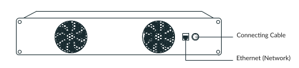
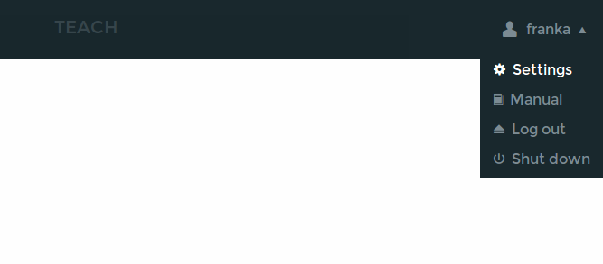
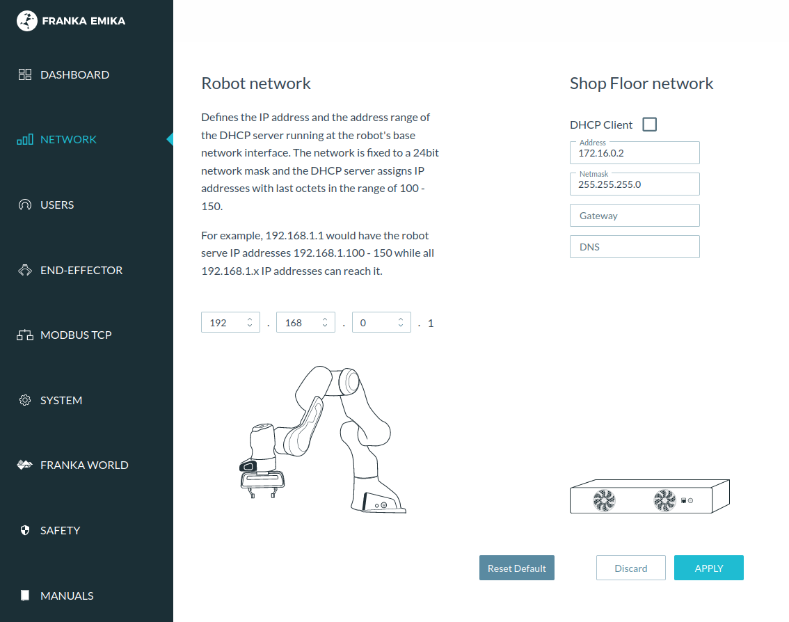

Getting started
===============

After setting up the required software for :doc:`Linux <installation_linux>` or
:doc:`Windows <installation_windows>`, it is time to connect to the robot and test the whole setup
by using FCI to read the current robot state.

Operating the robot
-------------------

Before going further though, here are a few safety considerations.
Always check the following things before powering on the robot:

1. Make sure that the Arm has been mounted on a stable base and cannot topple over, even
   when performing fast motions or abrupt stops.

.. caution::
   Only tabletop mounting is supported, i.e. the Arm must be mounted perpendicular to the
   ground! Other mountings will **void your warranty** and **might cause damage
   to the robot**!

2. Ensure that the cable connecting Arm and Control is firmly attached on both sides.
3. Connect the external activation device to Arm's base and keep it next to you in order to be
   able to stop the robot at any time.

.. hint::
   Activating the external activation device will disconnect the Arm from Control.
   The joint motor controllers will then hold their current position.
   **The external activation device is not an emergency stop!**

This list is non-exhaustive! The manual delivered with your robot contains a chapter dedicated
to safety. Please read it carefully and follow the instructions.

.. important::
   The workstation PC which commands your robot using the FCI must always be connected to the LAN
   port of Control (shop floor network) and **not** to the LAN port of the Arm (robot network).

.. _setting-up-the-network:

Setting up the network
----------------------

Good network performance is crucial when controlling the robot using FCI.
Therefore it is strongly recommended to use a direct connection between the
workstation PC and Panda's Control. This section describes how to configure your
network for this use case.

    Use Control's LAN port when controlling the robot through FCI.
    Do not connect to the port in Arm's base.

The Control and your workstation must be configured to appear on the same
network. Simplest way to achieve that is to use static IP addresses. Any two
addresses on the same network would work, but the following values will be used
for the purpose of this tutorial:

+---------+----------------+------------+
|         | Workstation PC |  Control   |
+=========+================+============+
| Address | 172.16.0.1     | 172.16.0.2 |
+---------+----------------+------------+
| Netmask | 24             | 24         |
+---------+----------------+------------+

The Control's address (172.16.0.2) is called ``<fci-ip>`` in the following chapters.

.. hint::
    With this network configuration, Desk can be accessed via ``https://<fci-ip>``, although
    you will see a certificate warning in your browser.

The configuration process consists of two steps:

  * Configuring Control's network settings.
  * Configuring your workstation's network settings.

Control network configuration
^^^^^^^^^^^^^^^^^^^^^^^^^^^^^

For this step, the robot needs to be installed and tested. **Please read through
the documents shipped with your robot and follow the setup instructions before
continuing any further!**

The Control's network can be configured in the administrator's interface. For
the duration of this step you can connect to the robot through the port in the
robot's base. For details, consult the `Connecting a user interface device`
section in the manual delivered with your robot.

    Accessing the administrator's interface through Desk.

To set up a static address, enter the following values in the `Network` section:

    Setting a static IP for the Control's LAN port (Shop Floor network).
    DHCP Client option is deselected.

Press `Apply`. After the settings are successfully applied, connect your
workstation's LAN port to the robot's control unit.

Linux workstation network configuration
^^^^^^^^^^^^^^^^^^^^^^^^^^^^^^^^^^^^^^^

This section describes how to set up a static IP address on Ubuntu 16.04
using the GUI. Follow the official Ubuntu guide_ if you prefer to use the
command line.

.. _guide: https://help.ubuntu.com/lts/serverguide/network-configuration.html

.. caution::
    The following steps will modify your network settings. If in doubt,
    contact your network's administrator.

First, go to Network Connection widget. Select the wired connection you
will be using and click edit.

.. figure:: _static/edit-connections.png
    :align: center
    :figclass: align-center

    Edit the connection in the Ethernet section.

Next, click on the IPv4 settings tab, set the method to Manual, and enter the
following values:

.. figure:: _static/static-ip-ubuntu.png
    :align: center
    :figclass: align-center

    Setting a static IP for the Workstation PC. Method is set to Manual.

.. hint::
   This step will disable DHCP, which means you will no longer obtain an address
   when connecting to a DHCP server, like the one in Arm's base. When you no
   longer use FCI, you can change the Method back to `Automatic (DHCP)`.

Save the changes, and close the Network Connection window. Click on the
connection name from the drop down menu. It should now be possible to connect to
the robot from your workstation. To verify this, perform the
:ref:`network-bandwidth-delay-test`. From now on, you can also access Desk
through this address in your browser.

Windows workstation network configuration
^^^^^^^^^^^^^^^^^^^^^^^^^^^^^^^^^^^^^^^^^
Setup a static IP address on the Windows workstation. Therefore, open **Control Panel** and go to
**Network and Internet** > **Network and Sharing Center** > **Change adapter settings**.
Right-click the network adapter and open **Properties**. Use the same example address and netmask
as in the Linux workstation network configuration.

Verifying the connection
------------------------

The previous section described how to specify the IP address of the Control's
LAN port. In the following sections that address is referred to as ``<fci-ip>``.

In order to verify that everything is correctly set up, run the ``echo_robot_state``
example from ``libfranka``. If you decided to install ``franka_ros`` and ``libfranka`` from the ROS
repository, you can instead read the instructions for
:ref:`visualizing the robot in ros <ros_visualization>` .

Change to the build directory of ``libfranka`` and execute the example:

*Linux*:

.. code-block:: shell

    ./examples/echo_robot_state <fci-ip>

*Windows*:

.. code-block:: shell

    cd /path/to/libfranka/build/examples/
    echo_robot_state.exe <fci-ip>

.. hint::
    Before executing libfranka programms, make sure that the executables are able to find their runtime libraries.
    On Windows, the easiest way is to copy the needed libraries into the same directory as the executable.

The program will print the current state of the robot to the console and terminate after a few
iterations. The fields are explained in the
`libfranka API documentation <https://frankaemika.github.io/libfranka/structfranka_1_1RobotState.html>`_.

Example output:

.. code-block:: json

    {
      "O_T_EE": [0.998578,0.0328747,-0.0417381,0,0.0335224,-0.999317,0.0149157,0,-0.04122,-0.016294,
                 -0.999017,0,0.305468,-0.00814133,0.483198,1],
      "O_T_EE_d": [0.998582,0.0329548,-0.041575,0,0.0336027,-0.999313,0.0149824,0,-0.0410535,
                   -0.0163585,-0.999023,0,0.305444,-0.00810967,0.483251,1],
      "F_T_EE": [0.7071,-0.7071,0,0,0.7071,0.7071,0,0,0,0,1,0,0,0,0.1034,1],
      "EE_T_K": [1,0,0,0,0,1,0,0,0,0,1,0,0,0,0,1],
      "m_ee": 0.73, "F_x_Cee": [-0.01,0,0.03], "I_ee": [0.001,0,0,0,0.0025,0,0,0,0.0017],
      "m_load": 0, "F_x_Cload": [0,0,0], "I_load": [0,0,0,0,0,0,0,0,0],
      "m_total": 0.73, "F_x_Ctotal": [-0.01,0,0.03], "I_total": [0.001,0,0,0,0.0025,0,0,0,0.0017],
      "elbow": [-0.0207622,-1], "elbow_d": [-0.0206678,-1],
      "tau_J": [-0.00359774,-5.08582,0.105732,21.8135,0.63253,2.18121,-0.0481953],
      "tau_J_d": [0,0,0,0,0,0,0],
      "dtau_J": [-54.0161,-18.9808,-64.6899,-64.2609,14.1561,28.5654,-11.1858],
      "q": [0.0167305,-0.762614,-0.0207622,-2.34352,-0.0305686,1.53975,0.753872],
      "dq": [0.00785939,0.00189343,0.00932415,0.0135431,-0.00220327,-0.00492024,0.00213604],
      "q_d": [0.0167347,-0.762775,-0.0206678,-2.34352,-0.0305677,1.53975,0.753862],
      "dq_d": [0,0,0,0,0,0,0],
      "joint_contact": [0,0,0,0,0,0,0], "cartesian_contact": [0,0,0,0,0,0],
      "joint_collision": [0,0,0,0,0,0,0], "cartesian_collision": [0,0,0,0,0,0],
      "tau_ext_hat_filtered": [0.00187271,-0.700316,0.386035,0.0914781,-0.117258,-0.00667777,
                               -0.0252562],
      "O_F_ext_hat_K": [-2.06065,0.45889,-0.150951,-0.482791,-1.39347,0.109695],
      "K_F_ext_hat_K": [-2.03638,-0.529916,0.228266,-0.275938,0.434583,0.0317351],
      "theta": [0.01673,-0.763341,-0.0207471,-2.34041,-0.0304783,1.54006,0.753865],
      "dtheta": [0,0,0,0,0,0,0],
      "current_errors": [], "last_motion_errors": [],
      "control_command_success_rate": 0, "robot_mode": "Idle", "time": 3781435
    }

.. hint::

    If an error occurs at this point, perform the
    :ref:`ping test <troubleshooting_robot_not_reachable>` and ensure that the robot's fail-safe
    safety locking system is opened. Further information are provided in the manual shipped with
    the robot.
