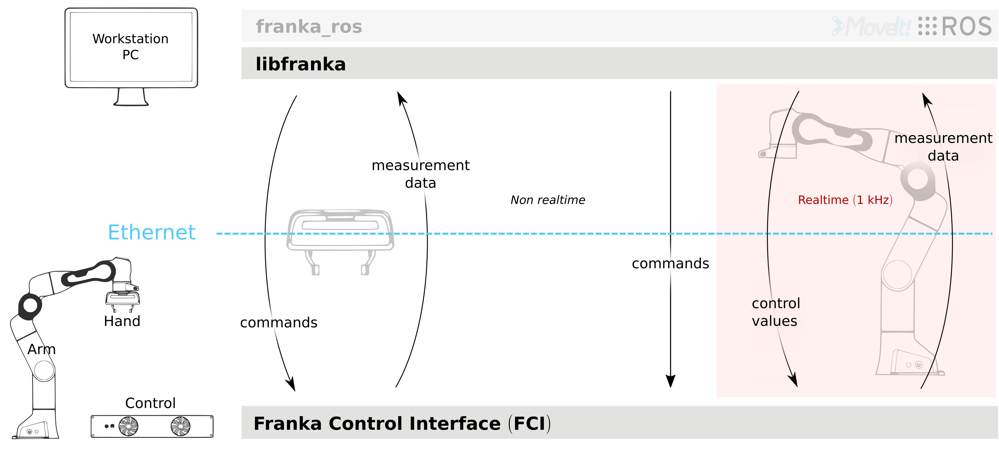
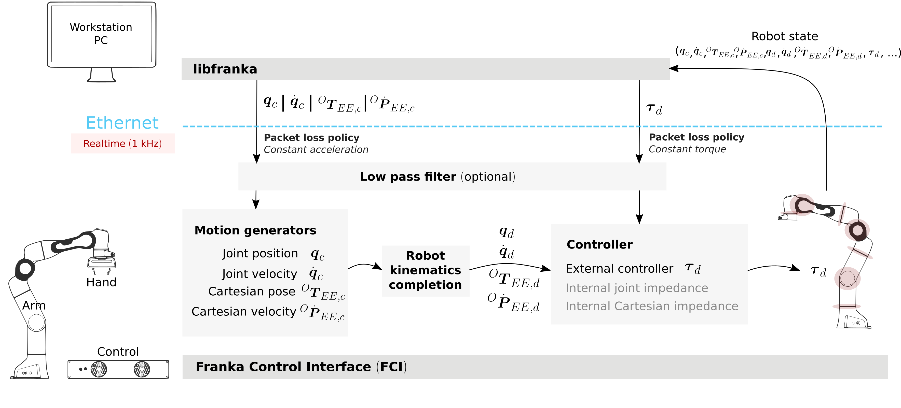

libfranka
=========

Before continuing with this chapter, please install or compile libfranka for :doc:`Linux <installation_linux>`
or :doc:`Windows <installation_windows>`.
API documentation for the latest version of ``libfranka`` is available at
https://frankaemika.github.io/libfranka.

    Schematic overview

``libfranka`` is the C++ implementation of the client side of the FCI. It handles the network
communication with Control and provides interfaces to easily:

 * execute **non-realtime commands** to control the Hand and configure Arm parameters.
 * execute **realtime commands** to run  your own 1 kHz control loops.
 * read the **robot state** to get sensor data at 1 kHz.
 * access the **model library** to compute your desired kinematic and dynamic parameters.

During operation you might also encounter several **errors** that we detail at the end of
this section.

Non-realtime commands
---------------------

Non-realtime commands are blocking, TCP/IP-based and always executed `outside` of any realtime
control loop. They encompass all of the Hand commands and some configuration-related commands
for the Arm.

.. figure:: _static/fci-architecture-non-realtime.png
    :align: center
    :figclass: align-center

    Non-realtime commands for both Arm and Hand.

The most relevant ones for the Hand are

 * ``homing`` which calibrates the maximum grasping width of the Hand.
 * ``move``, ``grasp`` and ``stop``, to move or grasp with the Hand.
 * ``readOnce``, which reads the Hand state.

Concerning the Arm, some useful non-realtime commands are:

 * ``setCollisionBehavior`` which sets the contact and collision detection thresholds.
 * ``setCartesianImpedance`` and ``setJointImpedance`` which set the impedance parameters
   for the internal Cartesian impedance and internal joint impendace controllers.
 * ``setEE`` sets the transformation *NE_T_EE* from nominal end effector to end effector
   frame. The transformation from flange to end effector frame *F_T_EE* is split into two
   transformations: *F_T_NE* and *NE_T_EE*. The transformation from flange to nominal end
   effector frame *F_T_NE* can only be set through the administrator's interface.
 * ``setK`` sets the transformation *EE_T_K* from end effector frame to stiffness frame.
 * ``setLoad`` sets the dynamic parameters of a payload.
 * ``automaticErrorRecovery`` that clears any command or control exception that previously
   happened in the robot.

For a complete and fully specified list check the API documentation for the
`Arm <https://frankaemika.github.io/libfranka/classfranka_1_1Robot.html>`__
or the `Hand <https://frankaemika.github.io/libfranka/classfranka_1_1Gripper.html>`__.

All operations (non-realtime or realtime) on the Arm or the Hand are performed through the
``franka::Robot`` and ``franka::Gripper`` objects respectively. A connection to the Arm/Hand
will be established when the object is created:

.. code-block:: c++

    #include <franka/robot.h>
    #include <franka/gripper.h>

    ...

    franka::Gripper gripper("<fci-ip>");
    franka::Robot robot("<fci-ip>");

The address can be passed either as a hostname or an IP address. In case of any error, either due
to networking or conflicting library version, an exception of type ``franka::Exception`` will
be thrown. When using several robots at the same time, simply create several objects with
appropriate IP addresses.

To run a specific command, simply call the corresponding method, e.g.

.. code-block:: c++

    gripper.homing();
    robot.automaticErrorRecovery();

Realtime commands
-----------------

Realtime commands are UDP based and require a 1 kHz connection to Control.
There are two types of realtime interfaces:

 * **Motion generators**, which define a robot motion in joint or Cartesian space.
 * **Controllers**, which define the torques to be sent to the robot joints.

There are 4 different types of external motion generators and 3 different types of controllers
(one external and 2 internal) as depicted in the following figure:

.. figure:: _static/rt-interfaces.png
    :align: center
    :figclass: align-center

    Realtime interfaces: motion generators and controllers.

You can either use a single interface or combine two different types. Specifically, you can
command:

 * *only a motion generator* and therefore use one of the two internal controllers to follow
   the commanded motion.
 * *only an external controller* and ignore any motion generator signals, i.e. torque control only.
 * *a motion generator and an external controller* to use the inverse kinematics of Control in
   your external controller.

All realtime loops (motion generator or controller) are defined by a callback function that
receives the robot state and the duration of the last cycle (1 ms unless packet losses occur)
and returns the specific type of the interface. The ``control`` method of the ``franka::Robot``
class will then run the control loop by executing the callback function at a 1 kHz frequency,
as shown in this example

.. code-block:: c++

  std::function<franka::Torques(const franka::RobotState&, franka::Duration)>
     my_external_controller_callback;
  // Define my_external_controller_callback
  ...

  std::function<franka::JointVelocities(const franka::RobotState&, franka::Duration)>
      my_external_motion_generator_callback;
  // Define my_external_motion_generator_callback
  ...

  try {
    franka::Robot robot("<fci-ip>");
    // only a motion generator
    robot.control(my_external_motion_generator_callback);
    // only an external controller
    robot.control(my_external_controller_callback);
    // a motion generator and an external controller
    robot.control(my_external_motion_generator_callback, my_external_controller_callback);
  } catch (franka::Exception const& e) {
    std::cout << e.what() << std::endl;
    return -1;
  }
    return 0;
  }

All control loops are finished once the ``motion_finished`` flag of a realtime command is set
to ``true``. An excerpt of the ``generate_joint_velocity_motion`` example included
in the `libfranka examples <https://frankaemika.github.io/libfranka/examples.html>`__ is shown here

.. code-block:: c++

   robot.control(
        [=, &time](const franka::RobotState&, franka::Duration period) -> franka::JointVelocities {
          time += period.toSec();

          double cycle = std::floor(std::pow(-1.0, (time - std::fmod(time, time_max)) / time_max));
          double omega = cycle * omega_max / 2.0 * (1.0 - std::cos(2.0 * M_PI / time_max * time));

          franka::JointVelocities velocities = {{0.0, 0.0, 0.0, omega, omega, omega, omega}};

          if (time >= 2 * time_max) {
            std::cout << std::endl << "Finished motion, shutting down example" << std::endl;
            return franka::MotionFinished(velocities);
          }
          return velocities;
        });

In this case, the callback function is defined directly in the call of the
``robot.control( ... )`` function. It uses the joint velocity motion generator interface,
as it returns a ``franka::JointVelocities`` object. It commands joint velocities to the last four
joints and move them by approx. +/-12 degrees. After ``2 * time_max`` seconds it will return a
``motion_finished`` flag by setting it to true with the ``franka::MotionFinished`` method and
the control loop will stop.

Note that if you use only a motion generator, the default controller is the internal joint
impedance controller. You can however use the internal Cartesian impedance controller by
setting the optional argument of the control function, e.g.

.. code-block:: c++

    // Set joint impedance (optional)
    robot.setJointImpedance({{3000, 3000, 3000, 3000, 3000, 3000, 3000}});
    // Runs my_external_motion_generator_callback with the default joint impedance controller
    robot.control(my_external_motion_generator_callback);
    // Identical to the previous line (default franka::ControllerMode::kJointImpedance)
    robot.control(my_external_motion_generator_callback, franka::ControllerMode::kJointImpedance);

    // Set Cartesian impedance (optional)
    robot.setCartesianImpedance({{2000, 2000, 2000, 100, 100, 100}});
    // Runs my_external_motion_generator_callback with the Cartesian impedance controller
    robot.control(my_external_motion_generator_callback, franka::ControllerMode::kCartesianImpedance);

For writing a controller, the ``franka::Robot::control`` function is used as well. The following
example shows a simple controller commanding zero torque for each joint. Gravity is
compensated by the robot.

.. code-block:: c++

    robot.control([&](const franka::RobotState&, franka::Duration) -> franka::Torques {
          return {{0.0, 0.0, 0.0, 0.0, 0.0, 0.0, 0.0}};
        });

You can find examples for all interfaces and combinations of control loops in the
`libfranka examples <https://frankaemika.github.io/libfranka/examples.html>`__. Prior to running
the examples, verify that the robot has enough free space to move without colliding. Then, for
instance for the ``generate_joint_velocity_motion`` example execute the following command from
the ``libfranka`` build directory:

.. code-block:: shell

    ./examples/generate_joint_velocity_motion <fci-ip>

.. warning::

    For writing your own motion generators or controllers it is crucial to deliver a smooth
    signal to the robot. Nonsmooth signals can easily generate discontinuity errors or even
    make the robot unstable. Check the :ref:`interface specifications
    <control_parameters_specifications>` before starting.

.. _signal-processing:

Signal processing
*******************
To facilitate the control of the robot under non-ideal network connections, libfranka includes
signal processing functions that will modify the user-commanded values to make them conform
with the :ref:`limits of the interface<control_parameters_specifications>`.
There are two *optional* functions included in all realtime control loops:

 * A first-order **low-pass filter** to smooth the user-commanded signal.
 * A **rate limiter**, that saturates the time derivatives of the user-commanded values.

* As of version ``0.5.0``, libfranka includes a **low-pass filter** for all realtime
  interfaces **running by default** with a 100 Hz cutoff frequency.
  The filter smooths commanded signals
  to provide more stable robot motions but does not prevent the violation of the
  :ref:`limits of the interface<control_parameters_specifications>`.

  .. important::

    As of version ``0.5.0`` the ``Robot::setFilters`` command is deprecated in favor of
    the low-pass filter functionality of the ``Robot::control`` function.

* As of version ``0.4.0``, **rate limiters** for all realtime interfaces are
  **running by default**. `Rate limiters`, also called `safe controllers`, will limit the
  rate of change of the signals sent by the user to prevent the violation of the
  :ref:`limits of the interface<control_parameters_specifications>`. For motion generators, it
  will limit the acceleration and jerk, while, for an external controller, it will limit the
  torque rate. Their main purpose is to increase the robustness of your control loop.
  In case of packet losses, even when the signals that you send conform with the
  interface limits, Control might detect a violation of velocity, acceleration or jerk limits.
  Rate limiting will adapt your commands to make sure that this does not happen.
  Check the :ref:`noncompliant errors section<noncompliant-errors>` for more details.

  .. caution::

    Rate limiting will ensure no limits are violated except for the joint limits after
    inverse kinematics, whose violation produces the family of errors starting with
    ``cartesian_motion_generator_joint_*``. Check the
    :ref:`noncompliant errors section<noncompliant-errors>` for more details.

  .. hint::

    The limits used in the rate limiter are defined in ``franka/rate_limiting.h``
    and are set to the interface limits. If this produces a jerky or unstable behavior
    you can set the limits to lower values, activate the low-pass filter or reduce its cutoff
    frequency.

To control the signal processing functions, all ``robot.control()`` function calls
have two additional optional parameters. The first one is a flag to activate or
deactivate the rate limiter while the second one
specifies the cutoff frequency of the first-order low-pass filter. If the cutoff frequency
``>=1000.0`` the filter will be deactivated. For instance

.. code-block:: c++

    // Set Cartesian impedance (optional)
    robot.setCartesianImpedance({{2000, 2000, 2000, 100, 100, 100}});
    // Runs my_external_motion_generator_callback with the Cartesian impedance controller,
    // rate limiters on and low-pass filter with 100 Hz cutoff
    robot.control(my_external_motion_generator_callback, franka::ControllerMode::kCartesianImpedance);
    // Identical to the previous line (default true, 100.0 Hz cutoff)
    robot.control(my_external_motion_generator_callback, franka::ControllerMode::kCartesianImpedance, true, 100.0);
    // Runs my_external_motion_generator_callback with the Cartesian impedance controller,
    // rate limiters off and low-pass filter off
    robot.control(my_external_motion_generator_callback, franka::ControllerMode::kCartesianImpedance, false, 1000.0);

Or similarly for an external controller

.. code-block:: c++

    // With rate limiting and filter
    robot.control(my_external_controller);
    // Identical to the previous line (default true, 100.0 Hz cutoff)
    robot.control(my_external_controller, true, 100.0);
    // Without rate limiting but with low-pass filter (100.0 Hz)
    robot.control(my_external_controller, false);
    // Without rate limiting and without low-pass filter
    robot.control(my_external_controller, false, 1000.0);

.. danger::

    The low-pass filter and the rate limiter are robustness features against packet losses
    to be used **after** you have already designed a smooth motion generator or controller.
    For the first tests of a new control loop we strongly recommend to deactivate these
    features.
    Filtering and limiting the rate of a nonsmooth signal can yield instabilities or
    unexpected behavior. Too many packet losses can also generate unstable behavior.
    Check your communication quality by monitoring the ``control_command_success_rate``
    signal of the robot state.

.. _control-side:

Under the hood
********************
Until now we have covered details of the interface running on the client side, i.e your own
workstation PC. The behavior of the full control loop including the Control side of the
realtime interface is shown in the following figure

    Realtime loop: from control commands to the robot desired joint torques.

**Motion generators**: all motion generator commands sent by the user have the subscript `c`
which stands for 'commanded'. When a motion generator is sent, the `Robot Kinematics completion`
block will compute the forward/inverse kinematics of the user-commanded signal yielding the
'desired' signals,  subscript `d`. If an internal controller is used, it will generate the
necessary torques :math:`\tau_{d}` to track the corresponding computed `d` signals (the internal
joint impedance controller will follow the joint signals :math:`q_{d}, \dot{q}_{d}` and the
internal Cartesian impedance controller the Cartesian ones
:math:`{}^OT_{EE,d}, {}^O\dot{P}_{EE,d}`) and send them to the robot joints.
All variables on the Control side of the figure, i.e. the last received `c` values
(after the low pass filter and the extrapolation due to packet losses,
read below for an explanation), the computed `d` values
and their time derivatives are sent back to the user in the robot state. This way you can
take advantage of the inverse kinematics in your own external controller and, at the same time,
it will offer you `full transparency`: you will always know the exact values
and derivatives that the robot received and tracked in the last sample.

.. hint::

    When you are using a *joint* motion generator, the `Robot kinematics completion` block will
    not modify the commanded *joint* values and therefore :math:`q_d, \dot{q}_d, \ddot{q}_d` and
    :math:`q_c, \dot{q}_c, \ddot{q}_c` are equivalent. Note that you will only find the
    `d` signals in the robot state. If you use a *Cartesian* motion generator, the `Robot
    kinematics completion` block might modify the user-commanded values to avoid singularities
    and therefore the desired signals :math:`{}^OT_{EE,d}, {}^O\dot{P}_{EE,d}` and the commanded
    signals :math:`{}^OT_{EE,c}, {}^O\dot{P}_{EE,c}, {}^O\ddot{P}_{EE,c}` might differ.
    You will find both the `d` and the `c` signals in the robot state.

**External controller**: if an external controller is sent, the desired joint torques commanded
by the user :math:`\tau_{d}` are directly fed to the robot joints.

Note that, on the Control side, there are two things that could modify your signals:

* `Packet losses`, which may occur if you:

   * don't have a very good connection due to the performance of your PC + network card.
   * your control loop is taking too long to compute (you have, depending on you network card and
     PC configuration, approx. < 300 :math:`\mu s` for your own control loop).

  In this case, Control assumes a constant acceleration model or a constant torque to extrapolate
  your signals. If ``>=20`` packets are lost in a row the control loop is stopped with the
  ``communication_constraints_violation`` exception.
* An optional `low-pass filter`. You can set the cutoff frequency with the non-realtime command
  ``setFilters``. Set it to ``1000`` to deactivate it. Since version ``0.5.0`` it's
  use is deprecated.

.. hint::

    If you are not sure if your signals are being filtered or extrapolated, you can always check the
    last commanded values that you sent and compare them with the values you receive on the robot
    state in the next sample. You will also find these values after an exception occurs in the
    ``franka::ControlException::log`` member of the exception.

Robot state
-----------------------
The robot state delivers the robot sensor readings and estimated values at a 1 kHz rate.
It provides:

 * *Joint level signals*: motor and estimated joint angles and their derivatives,
   joint torque and derivatives, estimated external torque, joint collision/contacts.
 * *Cartesian level signals*: Cartesian pose, configured endeffector and load parameters,
   external wrench acting on the endeffector, Cartesian collision
 * *Interface signals*: the last commanded and desired values and their derivatives,
   as explained in the previous subsection.

For a complete list check the API of the ``franka::RobotState``
`here <https://frankaemika.github.io/libfranka/structfranka_1_1RobotState.html>`__.
As shown in the the previous subsection, the robot state is always an input of all callback
functions for control loops. However, if you wish to only read the robot state without controlling
it, the functions ``read`` or ``readOnce`` can be used to gather it, e.g. for
logging or visualization purposes.

With a valid connection, *a single sample of the robot state* can be read using the ``readOnce``
function:

.. code-block:: c++

    franka::RobotState state = robot.readOnce();

The next example shows how to continuously read the robot state using the ``read`` function and a
callback. Returning ``false`` in the callback stops the loop. In the following, an excerpt of the
``echo_robot_state`` example is shown:

.. code-block:: c++

    size_t count = 0;
    robot.read([&count](const franka::RobotState& robot_state) {
      // Printing to std::cout adds a delay. This is acceptable for a read loop such as this,
      // but should not be done in a control loop.
      std::cout << robot_state << std::endl;
      return count++ < 100;
    });

Model library
--------------------
The robot model library provides

  - The forward kinematics of all robot joints.
  - The body and zero jacobian matrices of all robot joints.
  - Dynamic parameters: inertia matrix, Coriolis and centrifugal vector and gravity vector.

Note that after you load the model library, you can compute kinematic and dynamic parameters for
an arbitrary robot state, not just the current one. You can also use the model library in a non
realtime fashion, e.g. in an optimzation loop. The libfranka examples include exemplary code
`printing joint poses
<https://frankaemika.github.io/libfranka/print_joint_poses_8cpp-example.html>`_
or `computing jacobians and dynamic parameters
<https://frankaemika.github.io/libfranka/cartesian_impedance_control_8cpp-example.html>`_.

.. _control-errors:

Errors
-------

Using the FCI you will encounter several errors that happen either due to noncompliant
commands sent by the user, due to communication problems or due to the robot behavior.
The most relevant ones are detailed in the following subsections.
For a complete list please check the `API documentation
<https://frankaemika.github.io/libfranka/structfranka_1_1Errors.html>`_.

.. hint::

    Note that, after an error occurs, you can automatically clear it and continue running your
    program with the ``franka::Robot::automaticErrorRecovery()`` command without user intervention.
    Check the exception string before continuing to make sure that the error is not a critical
    one.

    Some errors can also be cleared manually by toggling the external activation device or by
    using the error recovery button in Desk.

.. _noncompliant-errors:

Errors due to noncompliant commanded values
********************************************
If the :ref:`commanded values<control-side>` sent by the user
do not comply with the :ref:`interface requirements<control_parameters_specifications>`,
one of the following errors will occur:

* Errors due to **wrong initial values of a motion generator**:

 - ``joint_motion_generator_start_pose_invalid``
 - ``cartesian_position_motion_generator_start_pose_invalid``
 - ``cartesian_motion_generator_start_elbow_invalid``
 - ``cartesian_motion_generator_elbow_sign_inconsistent``

 These errors indicate a discrepancy between the current robot values and the initial values sent
 by the user. To fix these errors, make sure that your control loop starts with the last commanded
 value observed in the robot state. For instance, for the joint position interface

 .. code-block:: c++

   double time{0.0};
   robot.control(
    [=, &time](const franka::RobotState& robot_state, franka::Duration period) -> franka::JointPositions {
      time += period.toSec();
      if (time == 0) {
        // Send the last commanded q_c as the initial value
        return franka::JointPositions(robot_state.q_c);
      } else {
        // The rest of your control loop
        ...
      }
    });

* Errors due to a **position limit** violation using a joint position/velocity motion generator,
  which will produce a ``joint_motion_generator_position_limits_violation``. Solving this error
  should be simple: make sure that the values that you send are in the
  :ref:`limits<control_parameters_specifications>`. Cartesian
  interfaces also have limits on the joint signals that result after the inverse kinematics: the
  ``cartesian_motion_generator_joint_position_limits_violation`` will be triggered if the inverse
  kinematics solver of Control yields a joint configuration out of the limits.

* Errors due to **velocity** limits violation and **discontinuity errors**, which refer to
  **acceleration** and/or **jerk** limits violation. If you use a joint motion generator the
  possible errors are

 - ``joint_motion_generator_velocity_limits_violation``
 - ``joint_motion_generator_velocity_discontinuity``  (acceleration limit violation)
 - ``joint_motion_generator_acceleration_discontinuity`` (jerk limit violation)

 If you use a Cartesian one, the possible errors are

 - Cartesian limits:

    - ``cartesian_motion_generator_velocity_limits_violation``
    - ``cartesian_motion_generator_velocity_discontinuity`` (acceleration limit violation)
    - ``cartesian_motion_generator_acceleration_discontinuity`` (jerk limit violation)

 - Joint limits after the inverse kinematics

    - ``cartesian_motion_generator_joint_velocity_limits_violation``
    - ``cartesian_motion_generator_joint_velocity_discontinuity``
      (acceleration limit violation)
    - ``cartesian_motion_generator_joint_acceleration_discontinuity`` (jerk limit violation)

 To mitigate velocity violations or discontinuity errors, make sure that the signals that
 you command do not violate the :ref:`limits<control_parameters_specifications>`. For every
 motion generator, Control differentiates the signals sent by the user with backwards Euler.
 For instance, if, using a joint position motion generator, at time :math:`k` the user sends
 the command :math:`q_{c,k}`, the resulting velocity, acceleration and jerk will be

 - Velocity :math:`\dot{q}_{c,k} = \frac{q_{c,k} - q_{c,k-1}}{\Delta t}`
 - Acceleration :math:`\ddot{q}_{c,k} = \frac{\dot{q}_{c,k} - \dot{q}_{c,k-1}}{\Delta t}`
 - Jerk :math:`\dddot{q}_{c,k} = \frac{\ddot{q}_{c,k} - \ddot{q}_{c,k-1}}{\Delta t}` ,

 where :math:`\Delta t = 0.001`. Note that :math:`q_{c,k-1}, \dot{q}_{c,k-1}` and
 :math:`\ddot{q}_{c,k-1}` are always sent back
 to the user in the robot state as :math:`q_{d}, \dot{q}_{d}` and
 :math:`\ddot{q}_{d}` so you will be able to
 compute the resulting derivatives in advance, even in case of packet losses. Check the
 :ref:`section about the details of the Control side of the interface<control-side>`
 for more details.

 Finally, for the torque interface a **torque rate** limit violation triggers the error

 - ``controller_torque_discontinuity``

 Control also computes the torque rate with backwards Euler, i.e.
 :math:`\dot{\tau}_{d,k} = \frac{\tau_{d,k} - \tau_{d,k-1}}{\Delta t}`. The previous desired
 torque commanded by the user is also sent back in the robot state as :math:`\tau_d`
 so you will also be able to compute the resulting torque rate in advance,
 even in case of packet losses.

.. hint::

    The rate limiters included in ``libfranka`` since version ``0.4.0`` modify the signals
    sent by the user to make them conform with all these limits except for the joint limits
    after the inverse kinematics. You can check the ``include/franka/rate_limiting.h`` and
    ``src/rate_limiting.cpp`` for exemplary code on how to compute resulting velocity,
    acceleration and jerk for all interfaces. We emphasize again that using rate limiting on a
    discontinuous signal can easily yield to unstable behavior, so please make sure that
    your signal is smooth enough before enabling this *robustness* feature.

Errors due to communication problems
************************************
If during a realtime loop Control does not receive any packets during 20 cycles, i.e. 20 ms, you
will receive a ``communication_constraints_violation`` error.
Note that if your connection has intermittent packet drops, it might not stop, but it could
trigger `discontinuity` errors even when your source signals conform with the interface
specification.
In that case, check our :ref:`troubleshooting section <motion-stopped-due-to-discontinuities>`
and consider enabling the :ref:`signal processing functions <signal-processing>`
to increase the robustness of your control loop.

Behavioral errors
******************
.. warning::

    These monitoring features are by no means conform with any safety norm and do not
    guarantee any safety to the user. They only aim for helping researchers during the
    development and testing of their control algorithms.

* **Reflex errors**. If the estimated external torques :math:`\hat{\tau}_{ext}` or forces
  :math:`{}^O\hat{F}_{ext}` surpass the configured thresholds, a ``cartesian_reflex`` or
  ``joint_reflex`` error will be triggered respectively. You can configure the thresholds
  with the ``franka::Robot::setCollisionBehavior`` non realtime command.

  .. hint::

      If you wish the robot to have contacts with the environment you must set the
      collision thresholds to higher values. Otherwise, once you grasp an object or push
      against a surface, a reflex will be triggered. Also, very fast or abrupt motions
      without contacts could
      trigger a reflex if thresholds are low; the external torques and forces are
      only *estimated* values that could be innacurate depending on the robot
      configuration, especially during high acceleration phases. You can monitor
      their values observing :math:`\hat{\tau}_{ext}` and :math:`{}^O\hat{F}_{ext}`
      in the robot state.

* **Self-collision avoidance**. If the robot reaches a configuration which is close to a
  self-collision, it will trigger a ``self_collision_avoidance_violation`` error.

  .. warning::
      This error does not guarantee that the robot will prevent a self collision at any
      configuration and speed. If, using the torque interface, you drive the robot at
      full speed against itself the robot might self-collide.

* If the **torque sensor limit** is reached, a ``tau_j_range_violation``
  will be triggered. This does not guarantee that the sensor will not be damaged after any
  high-torque interactions or motions but aims for preventing some of it.

* If the **maximum allowed power** is reached, the ``power_limit_violation`` will trigger
  and will prevent the robot from stopping and engaging the brakes during the control loop.

* If you reach the joint or the Cartesian limits you will get
  a ``joint_velocity_violation`` or a ``cartesian_velocity_violation`` error respectively.
