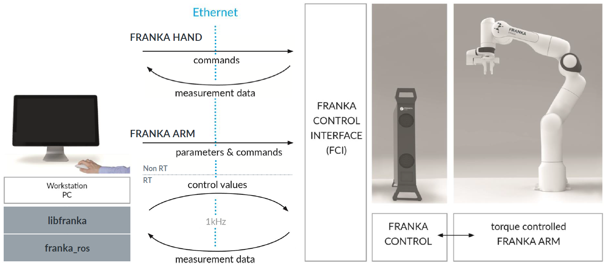

Overview
========

    Schematic overview of the components.

The Franka Control Interface (FCI) allows a fast and direct low-level bidirectional connection
to the Arm and Hand. It provides the current status of the robot and enables its direct control.
You can execute custom trajectories by sending real-time control values:

 * Desired gravity & friction compensated joint level torque commands.
 * Desired joint position or velocity command.
 * Desired Cartesian position or velocity command.

Furthermore, you get access to the following feedback data:

 * Measured joint data, such as the position, velocity and link side torque sensor signals.
 * Low-level desired joint goals.
 * Estimation of externally applied torques and wrenches.
 * Various collision and contact information.

.. important::

    While the FCI is active you have full, exclusive control of the Arm and Hand. This means that
    you `cannot` use Desk or Apps at the same time as the FCI.

The FCI client components are:

* ``franka_description``
* ``libfranka``
* ``franka_ros``

``franka_description`` provides `URDF <https://wiki.ros.org/urdf>`_ models and detailed 3D meshes
of our robots and end effectors. It also includes simplified meshes to be used for collision checks.

``libfranka`` provides a C++ interface which is run on a workstation PC. The connection to the FCI
is established via a standard Ethernet connection to Control. The FCI provides high-speed
measurements from the Arm and Hand. Furthermore, it accepts control commands at an update frequency
of 1 kHz. With this library, it is possible to:

* Retrieve information about the current state of the robot, e.g. current end effector pose, joint
  angles, or the gripper status.
* Execute motions by sending joint positions, joint velocities, Cartesian poses, or Cartesian
  velocities.
* Send joint level torque commands.
* Change parameters like the collision sensitivity, set additional loads, the joint or Cartesian
  stiffness etc.
* Calculate forward kinematics and other model properties from the current robot state.
* Control the gripper.
* Use the robot model library which provides the following:

  - Forward kinematics of all robot joints.
  - Jacobian matrix of all robot joints.
  - Dynamics: inertia matrix, Coriolis and centrifugal vector and gravity vector.

.. important::

    Data is sent over the network with a frequency of 1 kHz. Therefore, a good network connection
    is vital!

``franka_ros`` connects Franka Emika research robots with the entire ROS ecosystem. It provides
functionality equivalent to ``libfranka`` for `ROS Control <https://wiki.ros.org/ros_control>`_.
In combination with ``franka_description``, it allows visualization (e.g. RViz) and kinematic
simulations. `MoveIt! <https://wiki.ros.org/moveit>`_ integration makes it easy to move the robot
and control the gripper, and the provided examples show you how to control your robot using ROS.
