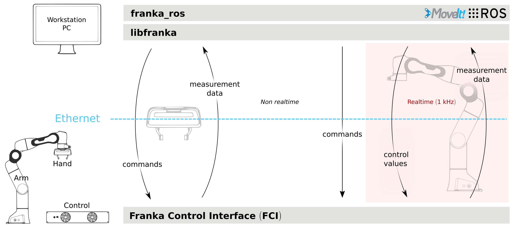

Overview
========

    Schematic overview.

The Franka Control Interface (FCI) allows a fast and direct low-level bidirectional connection
to the Arm and Hand. It provides the current status of the robot and enables its direct control
with an external workstation PC connected via Ethernet.
By using ``libfranka``, our open source C++ interface, you can send real-time control values
at 1 kHz with 5 different interfaces:

 * Gravity & friction compensated joint level torque commands.
 * Joint position or velocity commands.
 * Cartesian pose or velocity commands.

At the same time, you get access to 1 kHz measurements of:

 * Measured joint data, such as the position, velocity and link side torque sensor signals.
 * Estimation of externally applied torques and wrenches.
 * Various collision and contact information.

You get also access robot model library which provides:

 * Forward kinematics of all robot joints.
 * Jacobian matrix of all robot joints.
 * Dynamics: inertia matrix, Coriolis and centrifugal vector and gravity vector.

In addition, ``franka_ros`` connects Franka Emika research robots with the entire ROS ecosystem.
It integrates ``libfranka`` into  `ROS Control <https://wiki.ros.org/ros_control>`_.
Additionally, it includes `URDF <https://wiki.ros.org/urdf>`_ models and detailed 3D meshes of our
robots and end effectors, which allows visualization (e.g. RViz) and kinematic simulations.
`MoveIt! <https://wiki.ros.org/moveit>`_ integration makes it easy to move the robot and control
the gripper, and the provided examples show you how to control your robot using ROS.

.. important::

    Data is sent over the network with a frequency of 1 kHz. Therefore, a good network connection
    is required!

.. important::

    While the FCI is active you have full, exclusive control of the Arm and Hand. This means that
    you `cannot` use Desk or Apps at the same time as the FCI.
